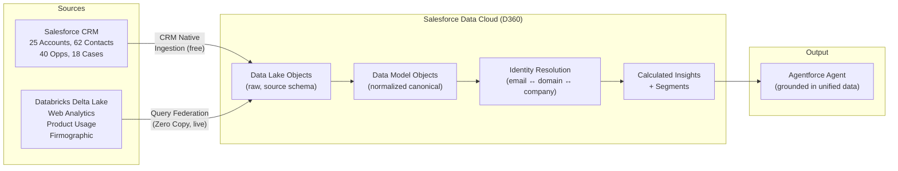
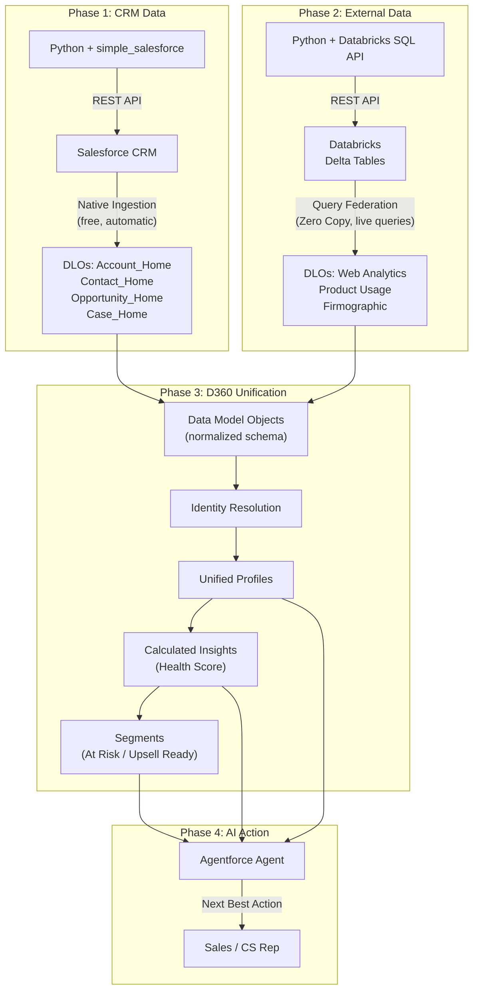
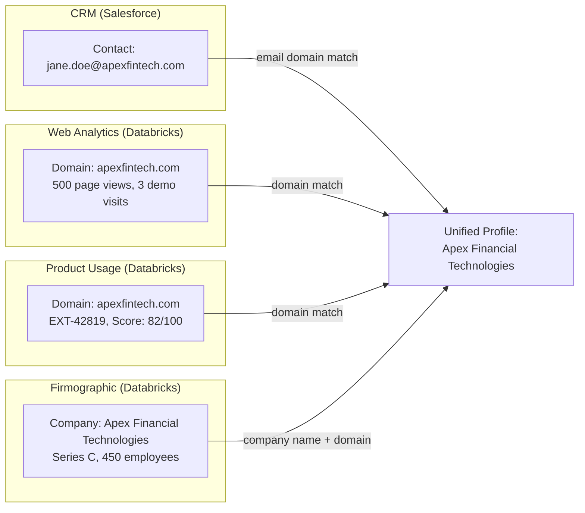

# Salesforce D360 + Agentforce Lab

Hands-on pipeline from raw data to AI agent: CRM data + Databricks Delta tables unified in Data Cloud (D360), grounded in Agentforce. Built to understand what D360 actually does at the infrastructure level, not just the slide deck version.



> D360's value proposition is straightforward: without it, your AI agent sees CRM data only. With it, the agent sees CRM + web engagement + product usage + third-party enrichment. The difference between "this account has an open deal" and "this account has an open deal, declining product usage, 3 escalated support tickets, and hasn't visited the pricing page in 60 days" is the difference between a chatbot and a useful agent.

## Who This Is For

- Exploring D360 (Data Cloud) architecture before an implementation or interview
- Have a Salesforce Developer Edition with Data Cloud enabled
- Have a Databricks workspace (trial works)
- Comfortable with Python and SQL

## Quick Start

```bash
# 1. Clone and set up
git clone https://github.com/btriani/salesforce-d360-agentforce-lab.git
cd salesforce-d360-agentforce-lab
python3 -m venv .venv && source .venv/bin/activate
pip install -r d360-agentforce-lab/01-synthetic-data/requirements.txt

# 2. Authenticate to Salesforce (OAuth, no SOAP)
sf org login web --alias my-dev-org

# 3. Load CRM data
cd d360-agentforce-lab/01-synthetic-data
python generate_and_load.py

# 4. Create Databricks tables (set DATABRICKS_HOST and DATABRICKS_TOKEN)
cd ../02-external-data
python generate_external_data.py
```

## Lab Structure

| # | Phase | What It Does | D360 Concepts |
|---|-------|-------------|---------------|
| 01 | [Synthetic CRM Data](d360-agentforce-lab/01-synthetic-data/) | Generate and load B2B data into Salesforce via REST API | CRM-native ingestion, data model foundation |
| 02 | [External Data](d360-agentforce-lab/02-external-data/) | Create Delta tables in Databricks via SQL API | External sources, Zero Copy, Query Federation |
| 03 | [D360 Configuration](d360-agentforce-lab/03-d360-config/) | Connect Databricks, create data streams, map DMOs | Data Streams, DLOs, DMOs, Identity Resolution |
| 04 | [Agentforce Agent](d360-agentforce-lab/04-agentforce-agent/) | Design agent grounded in unified D360 data | Prompt templates, Trust Layer, grounding |

## How D360 Compares to Alternatives

The customer data platform space has several players. D360's differentiator isn't any single feature — it's the tight integration between data unification, AI, and CRM action in one platform.

```mermaid
quadrantChart
    title CDP Positioning: Data Breadth vs CRM Integration
    x-axis "Standalone CDP" --> "CRM-Native CDP"
    y-axis "Structured Data Only" --> "Data + AI + Action"
    quadrant-1 "D360 territory"
    quadrant-2 "AI-first, CRM-light"
    quadrant-3 "Traditional CDP"
    quadrant-4 "CRM with basic data"
    Salesforce D360: [0.85, 0.88]
    Segment (Twilio): [0.25, 0.45]
    Tealium: [0.20, 0.40]
    Adobe CDP: [0.40, 0.65]
    Databricks + Unity Catalog: [0.15, 0.70]
    Snowflake + dbt: [0.10, 0.55]
    HubSpot: [0.75, 0.25]
```

| Dimension | Salesforce D360 | Segment / Tealium | Databricks + Unity Catalog | Snowflake + dbt |
|-----------|----------------|-------------------|---------------------------|-----------------|
| **CRM integration** | Native — zero-cost CRM ingestion, bidirectional | Connector-based, one-way | No CRM, requires ETL | No CRM, requires ETL |
| **External data** | Query Federation (Zero Copy), connectors, Ingestion API | SDKs, connectors | Native (it IS the lake) | Native (it IS the warehouse) |
| **Identity resolution** | Built-in, configurable match/reconciliation rules | Built-in, event-stream focused | Manual (write your own) | Manual (write your own) |
| **AI/Agent integration** | Agentforce natively grounded in unified data | None built-in | Mosaic AI, but no CRM context | Cortex, but no CRM context |
| **Zero Copy** | Yes — Databricks, Snowflake, BigQuery, Redshift | No | N/A (data is already there) | N/A |
| **Time to value** | Fast for Salesforce shops, config-heavy for external data | Fast for web/mobile events | Requires engineering team | Requires engineering team |
| **Vendor lock-in** | High (Salesforce ecosystem) | Medium | Low (open formats) | Medium |
| **Best for** | Enterprises already on Salesforce wanting unified customer view + AI agents | Marketing teams needing event tracking + audience activation | Data teams wanting full control over the lakehouse | Analytics teams wanting governed warehouse |

> **Honest take:** D360 shines when you're already in the Salesforce ecosystem and want AI agents that act on unified data. If your data already lives in Databricks/Snowflake and you don't use Salesforce CRM, D360 adds a layer you may not need. The Zero Copy federation is genuinely useful — it avoids the "copy everything into our platform" trap that most CDPs fall into. The weakness is the configuration complexity: DMO mapping, identity resolution setup, and Contact Point plumbing require significant upfront effort.

## Architecture Deep Dive

### Data Flow



### Identity Resolution Logic



### Data Intentionally Designed for Identity Resolution Testing

| Challenge | What We Did | Why It Matters |
|-----------|------------|----------------|
| Partial coverage | 5 of 25 companies excluded from web analytics | Tests how D360 handles missing data across sources |
| Foreign keys | Product usage uses `EXT-XXXXX` IDs, not Salesforce IDs | Proves identity resolution works without shared keys |
| Name variations | ~20% of firmographic names have "Inc.", "LLC", double spaces | Tests fuzzy matching in reconciliation rules |
| Domain matching | Contact emails use company domains; web analytics uses same domains | Shows the email-to-domain matching that powers IR |

## Key D360 Vocabulary

| Term | What It Actually Means |
|------|----------------------|
| **Data Stream** | A pipeline that brings data into Data Cloud (like an ETL job) |
| **DLO (Data Lake Object)** | Raw data container — preserves source schema as-is |
| **DMO (Data Model Object)** | Normalized canonical model — the "T" in ELT |
| **Query Federation** | D360 queries external data live (Databricks, Snowflake) without copying it |
| **Zero Copy** | Marketing term for Query Federation + file sharing — data doesn't move |
| **Identity Resolution** | Matching records across sources into unified profiles using match rules |
| **Calculated Insight** | A computed metric (e.g., Health Score) built on unified data |
| **Segment** | A group of entities filtered by criteria (e.g., "At Risk" accounts) |
| **Agentforce** | AI agent framework — value is proportional to the data it's grounded in |
| **Einstein Trust Layer** | Governance layer ensuring agents only access permitted data |
| **Profile vs Engagement** | Profile = what something IS (attributes). Engagement = what something DOES (events) |

## Tech Stack

| Technology | Usage |
|-----------|-------|
| Python 3.14 | Data generation (Faker), Salesforce REST API (simple_salesforce), Databricks SQL API |
| Salesforce Data Cloud | Data unification, Query Federation, identity resolution, segmentation |
| Databricks | Delta Lake tables, Serverless SQL Warehouse, Unity Catalog |
| Agentforce Studio | AI agent design, prompt templates, grounded actions |
| SF CLI (`sf`) | OAuth browser-flow authentication (no SOAP API) |
| GitHub Actions | (planned) Automated data refresh |

## What I Learned Building This

1. **Query Federation works well.** Connecting Databricks to D360 was straightforward — enter hostname, HTTP path, PAT, done. The "Direct Access (Accelerated)" stream type queries live and caches locally.

2. **DMO mapping is the real work.** The two-layer model (DLO → DMO) makes architectural sense but the UI-based mapping is manual and tedious. In production, use DevOps Data Kits and `sf project deploy start` for CI/CD.

3. **Identity Resolution has a steep setup curve.** The Individual DMO needs Contact Point Email/Phone objects with formula-based composite primary keys. The Sales Cloud data bundle helps but doesn't auto-configure everything. Understanding the architecture (Individual → Contact Points via Party ID → Match Rules) is more important than memorizing the UI steps.

4. **CRM-native ingestion is a genuine advantage.** Zero-cost, zero-config ingestion from Salesforce objects is something competitors can't match. It's the "unfair advantage" of building a CDP inside the CRM platform.

5. **Agentforce without D360 is limited.** An agent that only sees CRM data misses the full picture. D360 is what makes the difference between "this account has a deal" and "this account has a deal, declining usage, and 3 escalated tickets."

## Certifications

- Databricks Certified Generative AI Engineer
- Microsoft Certified Azure AI Engineer Associate (AI-102)
- AWS Certified Machine Learning Engineer Associate
- Google Cloud Professional Machine Learning Engineer

## License

[MIT](LICENSE)

---

All data is synthetic. No credentials, API keys, or proprietary data from any employer.
