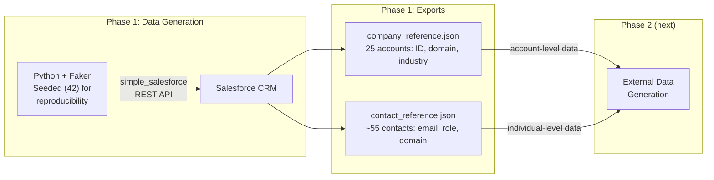

# Phase 1: Synthetic B2B Data → Salesforce CRM

Generate and load realistic B2B data into a Salesforce Developer Edition org using the REST API. This data becomes the CRM foundation that Data Cloud (D360) ingests natively — zero connector cost, zero configuration.

## What Gets Created

| Object | Count | Key Fields | D360 Mapping |
|--------|-------|------------|-------------|
| Account | 25 | Name, Industry, Domain, Revenue, Employees | Account DMO (standard) |
| Contact | ~55 | Name, Email (company domain), Title, Department | Individual DMO (standard) |
| Opportunity | ~35 | Stage, Amount ($50K–$500K), Close Date | Sales Order DMO (standard) |
| Case | ~18 | Subject, Priority, Status, Origin | Case DMO (standard) |

**Industries:** Financial Services (5), Healthcare (5), Retail (5), Manufacturing (5), Technology (5)



## Setup

```bash
# 1. Create and activate virtual environment (from repo root)
python3 -m venv .venv && source .venv/bin/activate

# 2. Install dependencies
pip install -r requirements.txt

# 3. Authenticate to Salesforce (OAuth browser flow — no SOAP)
sf org login web --alias my-dev-org

# 4. Run
python generate_and_load.py
```

## How It Works

The script connects to Salesforce using an access token from the SF CLI (`sf org display`), then creates records in dependency order: Accounts → Contacts → Opportunities → Cases.

**Authentication flow:**
1. `sf org login web` opens a browser for OAuth consent
2. `sf org display --json` returns the access token + instance URL
3. `simple_salesforce` uses these directly — no SOAP login, no stored passwords

**Email domain alignment:** Every Contact email uses the parent Account's domain (e.g., `jane.doe@apexfintech.com`). This is intentional — Phase 2's external data uses the same emails, creating the overlap needed for Identity Resolution in Phase 3.

> **Lesson Learned:** If you're building a D360 lab, plan your identifiers across phases before writing any code. Identity Resolution needs overlapping attributes (email, domain, phone) across sources. We design the CRM data with Phase 2's external data in mind.

## Output Files

| File | Purpose | Used By |
|------|---------|---------|
| `company_reference.json` | Maps Salesforce Account IDs to company domains/names | Phase 2 (firmographic data — account level) |
| `contact_reference.json` | Maps Contact emails to roles, departments, account info | Phase 2 (web analytics, product usage — individual level) |

These reference files bridge CRM data with external data. Phase 2 reads them to generate aligned external data that D360 can unify through Identity Resolution.

## Field Notes

**Why OAuth over SOAP?** The SF CLI's OAuth flow is the modern standard. SOAP login requires storing username + password + security token, which is both less secure and more fragile (security tokens reset when passwords change). OAuth gives you a session token via browser consent — no credentials stored in code.

**Why `simple_salesforce`?** It's the most widely-used Python library for Salesforce REST API. It accepts a session token directly, avoiding SOAP login entirely. For a lab, it's the right tool — lightweight, well-documented, no framework overhead.

**What happens when you load into a Data Cloud-enabled org?** Data Cloud automatically detects new CRM records and creates corresponding Data Lake Objects (DLOs). You don't configure this — it's "CRM-native ingestion." The DLOs appear in Data Cloud Setup within minutes. This zero-cost ingestion is D360's biggest advantage over standalone CDPs like Segment or Tealium, which need connectors for CRM data.

**Reproducibility:** `Faker.seed(42)` and `random.seed(42)` ensure the same data every run. This matters for a lab — students can compare their results against expected values. Phone numbers use a deterministic format `(555) XXX-XXXX` instead of Faker's random phone generator for the same reason.
