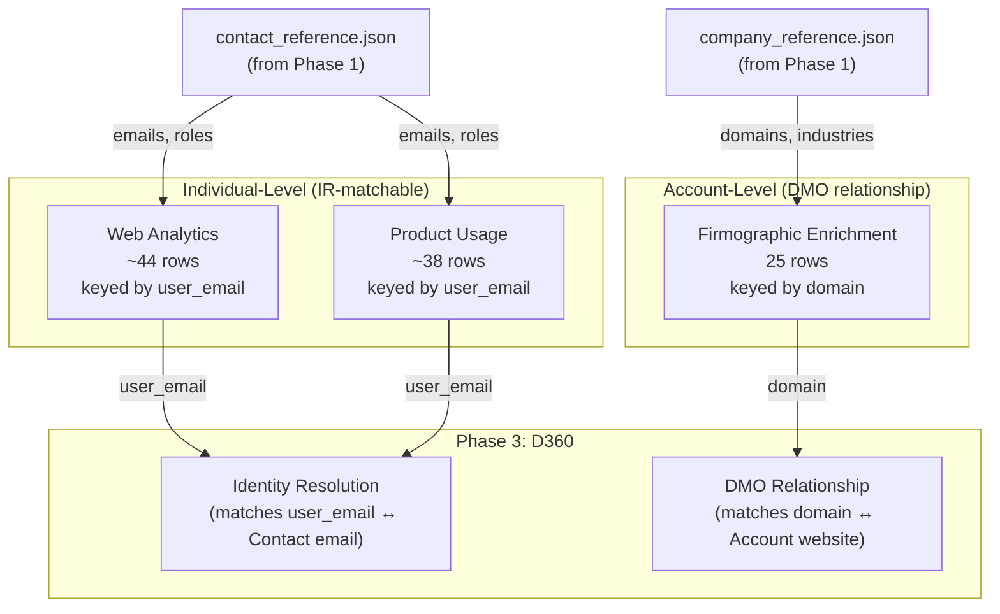

# Phase 2: External Data (Outside Salesforce)

Generate three external data sources that simulate data living outside Salesforce CRM. This is the data that makes D360 valuable — without it, your AI agent only sees sales-reported CRM data.

## Data Model



## Data Sources

### Web Analytics (Individual-Level)

Simulates Google Analytics / Mixpanel data — individual website visitor behavior.

| Field | Type | Purpose |
|-------|------|---------|
| `user_email` | STRING | **Primary key + IR match key** |
| `company_domain` | STRING | Account-level grouping |
| `page_views_30d` | INT | Engagement signal |
| `product_pages_viewed` | INT | Interest depth |
| `demo_page_visits` | INT | Sales intent signal |
| `avg_session_minutes` | DOUBLE | Engagement quality |
| `last_visit_date` | DATE | Recency signal |

**Coverage:** ~80% of contacts. VP of Sales and Head of Customer Success excluded (they don't browse the product website), plus 5 random exclusions to simulate incomplete tracking.

### Product Usage (Individual-Level)

Simulates product backend telemetry — API logs, feature usage, login activity.

| Field | Type | Purpose |
|-------|------|---------|
| `user_email` | STRING | **Primary key + IR match key** |
| `company_domain` | STRING | Account-level grouping |
| `account_id_external` | STRING | External system ID (EXT-XXXXX) |
| `feature_adoption_score` | INT | Health signal (15-95 range) |
| `api_calls_30d` | INT | Usage volume |
| `active_users` | INT | Per-company active user count |
| `last_login_date` | DATE | Recency / churn signal |
| `data_volume_gb` | DOUBLE | Utilization metric |

**Coverage:** ~70% of contacts. Non-technical roles excluded (VP of Sales, Head of CS, Director of Product don't log into the product).

### Firmographic Enrichment (Account-Level)

Simulates ZoomInfo / Clearbit enrichment data — company-level context.

| Field | Type | Purpose |
|-------|------|---------|
| `domain` | STRING | **Primary key + DMO match key** |
| `company_name` | STRING | ~20% have variations (Inc., LLC, etc.) |
| `employee_count` | INT | Company size |
| `annual_revenue_estimate` | LONG | Revenue estimate |
| `funding_stage` | STRING | Investment stage |
| `tech_stack_tags` | STRING | Technology tags |

**Coverage:** 100% of accounts. This is account-level data — it connects to the Account DMO via domain, NOT through Identity Resolution.

## Intentional Data Quality Challenges

| Challenge | What | Why It Matters |
|-----------|------|---------------|
| Partial coverage | Web ~80%, Product ~70% | D360 builds profiles from whatever sources are available |
| Role-based exclusions | Execs excluded from product usage | Not all people appear in all systems |
| Foreign key mismatch | EXT-XXXXX IDs in product usage | IR works on attributes (email), not foreign keys |
| Name variations | ~20% of firmographic names differ | Tests fuzzy matching in reconciliation rules |

> **Lesson Learned:** Our first version keyed all external data by company domain only. D360 Identity Resolution silently produced zero matches — no error, no warning. The root cause: IR matches **people**, not companies. External data must include individual-level identifiers (emails) that match CRM Contact emails. Company-level data (like firmographic) connects through DMO relationships instead.

## Setup

```bash
# Prerequisites: Phase 1 must be run first (generates reference files)

# Generate CSVs locally
cd d360-agentforce-lab/02-external-data
python generate_external_data.py

# To create Delta tables in Databricks:
# 1. Upload csv_exports/ to a Databricks volume
# 2. Import databricks_create_delta_tables.py as a notebook
# 3. Run All
```

## Output

- `csv_exports/web_analytics.csv` — individual-level web behavior
- `csv_exports/product_usage.csv` — individual-level product telemetry
- `csv_exports/firmographic_enrichment.csv` — account-level enrichment

## Field Notes

**Why individual-level, not account-level?** D360 Identity Resolution works at the Individual level — it creates Unified Individual Profiles by matching Contact Point objects (email, phone) across sources. If your external data only has company domains, IR has nothing to match. You need person-level identifiers that overlap with CRM Contact data.

**Why keep firmographic at account level?** Firmographic data describes companies, not people. It doesn't make sense to have per-person funding stage or tech stack. This data connects to D360 through DMO relationships (domain → Account), not through IR. Teaching both patterns is more valuable than forcing everything through IR.

**Why EXT-XXXXX IDs?** Real product databases don't use Salesforce Account IDs. The external ID format demonstrates that Identity Resolution works on attributes (email, domain, name), not shared primary keys. After IR unifies the data, the external ID becomes a useful cross-reference — but it's not the matching key.
