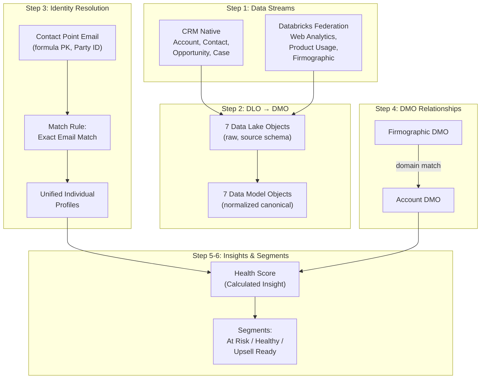
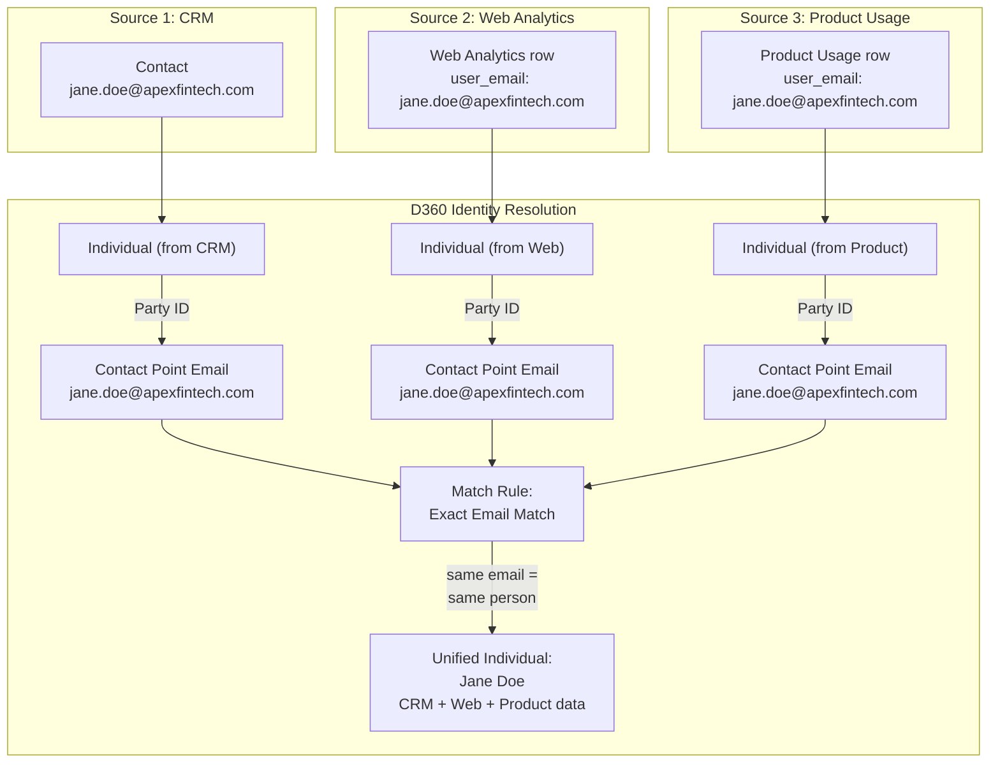
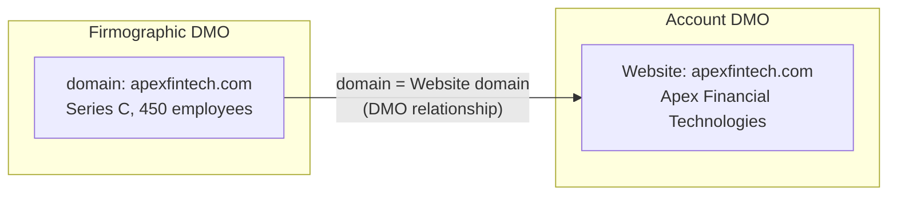

# Phase 3: D360 (Data Cloud) Configuration

Step-by-step configuration of Salesforce Data Cloud to ingest, model, and unify data from CRM and Databricks sources. This phase transforms raw data into unified customer profiles with actionable insights.



---

## Step 1: Connect Data Sources (Data Streams)

Configure 7 data streams to bring data into Data Cloud.

### CRM Data Streams (Native Ingestion)

These are automatic and free — one of D360's key advantages over standalone CDPs.

1. Navigate to **Setup → Data Cloud → Data Streams**
2. The following CRM objects should already appear as available data streams:

| # | Stream | Category | Expected Records |
|---|--------|----------|-----------------|
| 1 | Account | Profile | 25 |
| 2 | Contact | Profile | ~55 |
| 3 | Opportunity | Engagement | ~35 |
| 4 | Case | Engagement | ~18 |

3. For each stream: click **Set Up**, select the default field mapping, and deploy

> **Common Pitfall:** CRM data streams may show more records than Phase 1 created if your org has pre-existing data. If counts don't match, either clean the org first or filter by a custom field.

### Databricks Data Streams (Query Federation)

1. Navigate to **Setup → Data Cloud → Data Streams → New**
2. Select **Databricks** as the connector type
3. Enter connection details:
   - **Server Hostname:** your Databricks SQL Warehouse hostname
   - **Port:** 443
   - **HTTP Path:** your warehouse HTTP path (from SQL Warehouse settings)
   - **Authentication:** Username + PAT (Personal Access Token as password)

| Parameter | Value |
|-----------|-------|
| Server Hostname | `<your-databricks-hostname>.cloud.databricks.com` |
| Port | `443` |
| HTTP Path | `/sql/1.0/warehouses/<your-warehouse-id>` |
| Authentication | Username + PAT (Personal Access Token as password) |

4. Create 3 data streams from the `d360_lab` schema:

| # | Stream | Table | Category | Expected Records |
|---|--------|-------|----------|-----------------|
| 5 | Web Analytics | `d360_lab.web_analytics` | Engagement | ~44 |
| 6 | Product Usage | `d360_lab.product_usage` | Engagement | ~38 |
| 7 | Firmographic Enrichment | `d360_lab.firmographic_enrichment` | Profile | 25 |

5. For each stream, select **Direct Access (Accelerated)** as the stream type
   - This means D360 queries Databricks live but caches results locally for performance
   - The source of truth stays in Databricks — no data copying

> **Lesson Learned:** The Databricks connector setup was actually straightforward — enter hostname, HTTP path, PAT, done. The "Direct Access (Accelerated)" stream type is what you want for most use cases. It gives you the zero-copy benefit (data stays in Databricks) with local caching for query performance.

**Profile vs Engagement:** Categorize data streams based on what they represent:
- **Profile** = what an entity IS (attributes, relatively static): Account, Contact, Firmographic
- **Engagement** = what an entity DOES (events, time-series): Opportunity, Case, Web Analytics, Product Usage

This categorization affects how D360 handles updates and segmentation.

---

## Step 2: Map DLOs to DMOs

Data Lake Objects (DLOs) hold raw data in the source's original schema. Data Model Objects (DMOs) are the normalized canonical model. Mapping DLOs to DMOs is the "Transform" step — it's where you define how raw data maps to D360's standard data model.

### Standard DMOs (from CRM data)

Navigate to each DLO and map fields to the corresponding DMO:

**Account DLO → Account DMO:**

| DLO Field | DMO Field | Notes |
|-----------|-----------|-------|
| `Id` | `Account Id` | Primary key |
| `Name` | `Account Name` | |
| `Website` | `Website` | Used for firmographic domain matching |
| `Industry` | `Industry` | |
| `NumberOfEmployees` | `Number of Employees` | |
| `AnnualRevenue` | `Annual Revenue` | |
| `Phone` | `Phone` | |

**Contact DLO → Individual DMO:**

| DLO Field | DMO Field | Notes |
|-----------|-----------|-------|
| `Id` | `Individual Id` | Primary key |
| `FirstName` | `First Name` | |
| `LastName` | `Last Name` | |
| `Email` | `Contact Email` | Also creates Contact Point Email (Step 3) |
| `Title` | `Title` | |
| `AccountId` | `Account Id` | Links Individual to Account |

**Opportunity DLO → Sales Order DMO:**

| DLO Field | DMO Field | Notes |
|-----------|-----------|-------|
| `Id` | `Sales Order Id` | Primary key |
| `Name` | `Name` | |
| `StageName` | `Status` | |
| `Amount` | `Total Amount` | |
| `CloseDate` | `Close Date` | |
| `Probability` | `Win Likelihood %` | |
| `AccountId` | `Account Id` | Links to Account |

**Case DLO → Case DMO:**

| DLO Field | DMO Field | Notes |
|-----------|-----------|-------|
| `Id` | `Case Id` | Primary key |
| `Subject` | `Subject` | |
| `Priority` | `Priority` | |
| `Status` | `Status` | |
| `Origin` | `Origin` | |
| `AccountId` | `Account Id` | Links to Account |
| `ContactId` | `Individual Id` | Links to Individual |

### Custom DMOs (from Databricks data)

Create custom DMOs for each external data source:

**Web Analytics DLO → Web Analytics DMO (custom):**

| DLO Field | DMO Field | Type | Notes |
|-----------|-----------|------|-------|
| `user_email` | `User Email` | Text | Primary key; used for IR matching |
| `company_domain` | `Company Domain` | Text | Account grouping |
| `page_views_30d` | `Page Views 30d` | Number | |
| `product_pages_viewed` | `Product Pages Viewed` | Number | |
| `demo_page_visits` | `Demo Page Visits` | Number | |
| `avg_session_minutes` | `Avg Session Minutes` | Number | |
| `last_visit_date` | `Last Visit Date` | Date | |

**Product Usage DLO → Product Usage DMO (custom):**

| DLO Field | DMO Field | Type | Notes |
|-----------|-----------|------|-------|
| `user_email` | `User Email` | Text | Primary key; used for IR matching |
| `company_domain` | `Company Domain` | Text | Account grouping |
| `account_id_external` | `External Account Id` | Text | EXT-XXXXX format |
| `feature_adoption_score` | `Feature Adoption Score` | Number | |
| `api_calls_30d` | `API Calls 30d` | Number | |
| `active_users` | `Active Users` | Number | |
| `last_login_date` | `Last Login Date` | Date | |
| `data_volume_gb` | `Data Volume GB` | Number | |

**Firmographic DLO → Firmographic Enrichment DMO (custom):**

| DLO Field | DMO Field | Type | Notes |
|-----------|-----------|------|-------|
| `domain` | `Domain` | Text | Primary key; used for Account linking |
| `company_name` | `Company Name` | Text | |
| `employee_count` | `Employee Count` | Number | |
| `annual_revenue_estimate` | `Annual Revenue Estimate` | Number | |
| `funding_stage` | `Funding Stage` | Text | |
| `tech_stack_tags` | `Tech Stack Tags` | Text | |

> **Lesson Learned:** The DLO → DMO mapping is the most tedious part of D360 setup. The UI is point-and-click, one field at a time. In production, use **DevOps Data Kits** and `sf project deploy start` to automate this with metadata. For a lab, doing it manually helps you understand the two-layer model — but don't underestimate the time it takes.

---

## Step 3: Configure Contact Points & Identity Resolution

This is the critical step — and the one that was broken in our first attempt. Identity Resolution matches **people** across sources using Contact Point objects.

### Architecture



### Step 3a: Enable the Individual DMO

1. Navigate to **Setup → Data Cloud → Data Model**
2. Ensure the **Sales Cloud data bundle** is deployed — this creates the Individual DMO and Contact Point objects
3. If not deployed: **Setup → Data Bundles → Sales Cloud → Deploy**

### Step 3b: Configure Contact Point Email (CRM Contacts)

1. Navigate to the Contact DLO mapping
2. In addition to the Individual DMO mapping (done in Step 2), map the email field to **Contact Point Email DMO**:
   - `Email` → Contact Point Email → `Email Address`
   - Primary Key: use a formula field — `{ContactId} + "_email"`
   - `Party ID`: links this Contact Point Email to the parent Individual record

> **Common Pitfall:** The Contact Point Email needs a **composite primary key** using a formula. This is because multiple Contact Point Email records can exist for the same Individual (work email, personal email). The formula `{ContactId} + "_email"` creates a deterministic, unique ID.

### Step 3c: Map External Data Emails to Contact Point Email

For **Web Analytics** and **Product Usage**, map the `user_email` field to create Contact Point Email records:

1. Edit the Web Analytics DMO mapping
2. Add a mapping to **Contact Point Email DMO**:
   - `user_email` → `Email Address`
   - Primary Key: formula `{user_email} + "_web"` (unique per source)
   - Party ID: links to the Individual created from this source
3. Repeat for Product Usage:
   - `user_email` → `Email Address`
   - Primary Key: formula `{user_email} + "_product"`
   - Party ID: links to Individual

Each source creates its own Individual + Contact Point Email records. IR then matches across sources.

### Step 3d: Configure Match Rule

1. Navigate to **Setup → Data Cloud → Identity Resolution → Match Rules**
2. Create a new match rule:
   - **Name:** Email Exact Match
   - **Match type:** Exact
   - **Match on:** Contact Point Email → Email Address
   - **Apply to:** All data streams that produce Contact Point Email records

This rule fires when two Contact Point Email records from different sources share the same email address. It merges their parent Individuals into a single Unified Individual.

### Step 3e: Run and Verify

1. Navigate to **Setup → Data Cloud → Identity Resolution**
2. Click **Run Identity Resolution**
3. Wait for the job to complete (usually 5-15 minutes for this data volume)
4. Verify results:
   - **Expected unified individuals:** ~55 (matching the number of CRM Contacts)
   - **Expected matches from web analytics:** ~44 contacts linked
   - **Expected matches from product usage:** ~38 contacts linked
   - Contacts that appear in both web + product should resolve to a **single** Unified Individual

> **Lesson Learned:** When our external data only had company domains (no emails), IR produced zero matches — silently. No error, no warning. We spent hours manually linking records in the Data Cloud UI before realizing the root cause: IR matches people, not companies. External data must include the same individual-level identifiers (email) that exist in CRM Contacts. This single insight would have saved us days of troubleshooting.

---

## Step 4: Link Firmographic via DMO Relationships

Firmographic data is about companies, not people. It connects to D360 through **DMO relationships**, not Identity Resolution.

1. Navigate to the **Firmographic Enrichment DMO**
2. Create a **relationship field** pointing to the **Account DMO**
3. Map: `Firmographic.Domain` ↔ `Account.Website` (extract domain from Website URL)
4. This creates a direct link: every Firmographic record is associated with its matching Account

> **Key Concept:** This is the second integration pattern. IR handles people (Individual matching via email). DMO relationships handle companies (Account linking via domain). Real D360 implementations use both patterns — teaching them together is more valuable than forcing everything through IR.



---

## Step 5: Build Calculated Insight — Customer Health Score

Calculated Insights are computed metrics built on unified data. This is where D360's value becomes concrete — you're combining signals from 4 different systems into a single actionable score.

### Health Score Formula

```
Health Score (0-100) = (
    Product Adoption    × 0.40    (40% weight — strongest signal)
  + Web Engagement      × 0.20    (20% weight)
  + Support Health      × 0.20    (20% weight)
  + Deal Momentum       × 0.20    (20% weight)
)
```

### Component Definitions

| Component | Source DMO | Calculation | Range |
|-----------|-----------|-------------|-------|
| Product Adoption | Product Usage | Average `feature_adoption_score` across all users at the account | 0-100 |
| Web Engagement | Web Analytics | `min(page_views_30d / 500, 1) × 50 + min(demo_page_visits / 3, 1) × 50` | 0-100 |
| Support Health | Case | `100 - (open_cases × 15 + escalated_cases × 25)`, floor at 0 | 0-100 |
| Deal Momentum | Sales Order | `avg(Probability)` across open opps; 0 if no open opps | 0-100 |

### Setup Steps

1. Navigate to **Setup → Data Cloud → Calculated Insights**
2. Create a new Calculated Insight:
   - **Name:** CustomerHealthScore
   - **Related To:** Account
   - **Type:** Aggregate + Formula
3. Define the component metrics using the formulas above
4. Deploy and verify scores appear on Account records

> **Lesson Learned:** Calculated Insights run on unified data — that's the whole point. Without D360, you'd need to ETL product usage, web analytics, and CRM data into a warehouse, write SQL to join them, compute the score, and push it back to Salesforce. D360 does this natively because the data is already unified. The Health Score is the proof that unification creates value.

---

## Step 6: Create Segments

Segments group accounts by Health Score and activity signals. These segments feed directly into Agentforce agent actions (Phase 4).

### Segment Definitions

| Segment | Criteria | Expected Count | Agent Action |
|---------|----------|----------------|-------------|
| **At Risk** | Health Score < 40 | ~7-8 accounts | At Risk Detection |
| **Healthy** | Health Score 40-74 | ~10-12 accounts | Account Briefing |
| **Upsell Ready** | Health Score ≥ 75 AND demo_page_visits > 0 AND has open pipeline | ~5-7 accounts | Upsell Candidates |

### Setup Steps

1. Navigate to **Setup → Data Cloud → Segments**
2. Create each segment:
   - Select **Account** as the segment entity
   - Add filter criteria based on the Calculated Insight and activity data
   - Publish the segment
3. Verify membership counts match expected ranges

---

## Field Notes

### Why the two-layer DLO/DMO model exists

DLOs preserve the source schema exactly as it arrives — no transformation, no loss. DMOs normalize data into a canonical model. This separation means you can ingest from any source without worrying about schema alignment upfront. When the source schema changes (a column is renamed, a field is added), only the DLO-to-DMO mapping needs updating — the downstream DMOs, insights, and segments remain stable.

### Why Contact Point objects need formula-based PKs

Contact Point Email needs a unique primary key, but the same email can appear in multiple sources. The formula-based PK (`{ContactId}_email` or `{user_email}_web`) ensures uniqueness per source while allowing IR to match across sources on the email value itself. Without this, D360 would either reject duplicate emails or overwrite records from different sources.

### Profile vs Engagement: when to use each

This isn't just a label — it affects how D360 handles data:
- **Profile data** is upserted (latest version wins). Account attributes, firmographic data.
- **Engagement data** is appended (every event is kept). Web visits, product usage, support tickets.
Categorizing a data stream incorrectly leads to data loss (engagement treated as profile = only latest event kept) or bloat (profile treated as engagement = duplicate attribute records).

### CRM-native ingestion: D360's moat

Standalone CDPs (Segment, Tealium, mParticle) need to build and maintain connectors for every CRM. D360 ingests Salesforce objects with zero configuration and zero cost. This isn't just convenience — it means CRM data is always current, always complete, and always consistent with the source. Competitors pay a "connector tax" that D360 avoids by being built into the CRM platform.

### Production considerations

- **DevOps Data Kits:** Export your D360 configuration as metadata and deploy via `sf project deploy start`. This enables CI/CD for data model changes — essential for production but overkill for a lab.
- **Data refresh:** CRM data streams update automatically. Databricks streams (Direct Access) re-query on a schedule you configure. For a lab, manual refresh is fine.
- **Monitoring:** In production, set up alerts for IR match rate drops, data stream failures, and Calculated Insight staleness.
