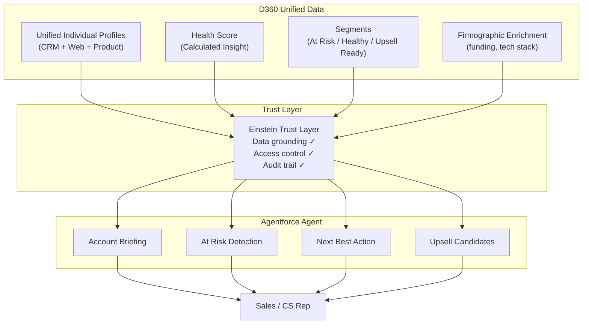

# Phase 4: Agentforce Agent Design

An Agentforce agent grounded in D360's unified data — the "last mile" where data becomes action. This phase demonstrates why data unification matters: the same question produces fundamentally different answers depending on whether the agent sees CRM data alone or the full unified picture.

## Agent Identity

- **Name:** D360 Account Intelligence Agent
- **Purpose:** Provide sales and CS reps with unified account intelligence
- **Persona:** Knowledgeable account analyst that always cites specific data points
- **Grounding:** All responses backed by D360 unified data — no hallucinated metrics

## Agent Architecture



## Agent Actions

### 1. Account Briefing

**Trigger:** "Brief me on {Account}"

**Data sources:** Unified profile + firmographic + all contacts' activity

**Output:** Full 360 view — CRM status, web engagement trends, product adoption, open cases, deal pipeline, firmographic context

### 2. At Risk Detection

**Trigger:** "Which accounts are at risk?" or "Show me at-risk accounts"

**Data sources:** At Risk segment + Health Score + recent cases

**Output:** Ranked list with specific risk signals:
- Declining product adoption score
- Stale login dates (>14 days)
- Escalated support tickets
- Dropping web engagement

### 3. Next Best Action

**Trigger:** "What should I do about {Account}?"

**Data sources:** Health Score + segment membership + all activity signals

**Output:** Prioritized recommendations with urgency:
- Schedule QBR (if Health Score dropping)
- Escalate to CS leadership (if multiple escalated cases)
- Send case study (if high engagement but no pipeline)
- Propose expansion (if Upsell Ready segment)

### 4. Upsell Candidates

**Trigger:** "Who's ready for upsell?" or "Show upsell opportunities"

**Data sources:** Upsell Ready segment + deal stage + web signals

**Output:** Ranked accounts with readiness evidence:
- High adoption score (≥75)
- Demo page visits in last 30 days
- Active pipeline in advanced stages
- Growing user count

## Prompt Templates

### Account Briefing Prompt

```
You are an Account Intelligence Agent for a B2B SaaS company.
You have access to unified customer data from Salesforce Data Cloud.

## Account Context
Account: {!Account.Name}
Industry: {!Account.Industry}
Health Score: {!CalculatedInsight.CustomerHealthScore}/100
Segment: {!Segment.Membership}
Firmographic: {!Firmographic.FundingStage}, {!Firmographic.EmployeeCount} employees

## Recent Activity (last 30 days)
Web Engagement: {!WebAnalytics.PageViews30d} page views, {!WebAnalytics.DemoPageVisits} demo visits
Product Usage: adoption score {!ProductUsage.FeatureAdoptionScore}, {!ProductUsage.ApiCalls30d} API calls
Last Login: {!ProductUsage.LastLoginDate}
Open Cases: {!Case.OpenCount} ({!Case.EscalatedCount} escalated)
Pipeline: {!Opportunity.OpenCount} open, total value {!Opportunity.TotalAmount}

## Instructions
Provide a comprehensive account briefing. Highlight:
1. Overall account health with specific evidence
2. Key risk signals or positive trends
3. Recommended next actions with urgency level
4. Which contacts to engage and why (based on their individual activity)
```

### At Risk Detection Prompt

```
You are an Account Intelligence Agent. Analyze the At Risk segment to identify
accounts that need immediate attention.

## At Risk Accounts
{!Segment.AtRisk.Members}

For each account, explain:
1. WHY they are at risk (cite specific metrics)
2. How URGENT the situation is (days since last login, case escalations)
3. What the recommended NEXT STEP is
4. Who to CONTACT (the most active individual at the account)

Rank by urgency. Be specific — "declining usage" is not enough.
Say "adoption score dropped from 82 to 34 in 30 days."
```

## The D360 Difference

The same question, fundamentally different answers:

### "Brief me on Apex Financial Technologies"

**Without D360 (CRM only):**

> "Apex Financial Technologies is a Financial Services account with 450 employees and $85M revenue. They have 2 open opportunities totaling $380K (Negotiation/Review stage) and 1 escalated support case about API rate limiting. Primary contact is Jane Doe (CTO)."

**With D360 (Unified Data):**

> "Apex Financial Technologies (Series C, AWS/Python stack) has a Health Score of **34/100 — AT RISK**.
>
> **Risk signals:**
> - Product adoption dropped to 38% (was 82% last quarter)
> - CTO Jane Doe hasn't logged in for 23 days
> - BUT: she visited the competitor comparison page 4 times this week
> - 1 escalated case (API rate limiting) open for 12 days
> - Data Engineer Mike Chen is still active (logged in yesterday, 2,400 API calls)
>
> **Recommended actions:**
> 1. **URGENT** — Escalate to CS leadership. The combination of declining adoption + competitor research + escalated case is a strong churn signal.
> 2. Schedule executive QBR within 5 business days
> 3. Engage Mike Chen (still active) to understand what's blocking adoption
> 4. Resolve the API rate limiting case — it may be the root cause of declining usage
>
> **Pipeline risk:** 2 open deals worth $380K at Negotiation stage. If this account churns, that pipeline is lost."

The first answer is a data dump. The second is actionable intelligence. That's the value of D360 — the agent sees signals from 4 different systems and connects them into a coherent narrative.

## Einstein Trust Layer

| Pillar | What It Does | Why It Matters |
|--------|-------------|----------------|
| **Data Grounding** | Agent responses must cite specific D360 data | No hallucinated metrics — "Health Score is 34" must come from the actual Calculated Insight |
| **Access Control** | Agent respects Salesforce sharing rules | A sales rep only sees their accounts. Field-level security applies through the Trust Layer |
| **Audit Trail** | Every agent response is logged with data sources accessed | Required for regulated industries (healthcare, financial services in our lab data) |

## Setup Steps

1. Navigate to **Setup → Agentforce Studio**
2. Create a new agent:
   - **Name:** D360 Account Intelligence Agent
   - **Description:** Unified account intelligence grounded in D360 data
3. Add agent actions (Account Briefing, At Risk, Next Best Action, Upsell)
4. Configure prompt templates with D360 merge fields
5. Set up grounding: link each action to the appropriate D360 data sources
6. Configure Trust Layer permissions
7. Test with sample queries against your lab data

## Field Notes

**Agentforce without D360 is a chatbot.** An agent that only sees CRM data can tell you about open deals and cases — but so can a Salesforce report. The value of an AI agent comes from connecting signals that humans miss: declining product usage + competitor page visits + escalated tickets = imminent churn risk. Without D360 unifying these signals, the agent can't see the pattern.

**Prompt design matters more than you think.** The merge fields (`{!CalculatedInsight.CustomerHealthScore}`) are just data injection. The real work is in the instructions: telling the agent to cite specific numbers, rank by urgency, recommend concrete actions. A well-designed prompt with D360 data produces genuinely useful output. A generic prompt produces generic output regardless of data quality.

**The Trust Layer is not optional.** In regulated industries (half our lab data is healthcare and financial services), every AI response must be auditable — what data was accessed, what was generated, who saw it. The Einstein Trust Layer handles this automatically, but only if the agent is properly configured to use D360 data sources (not custom API calls that bypass governance).
