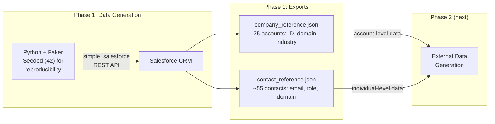
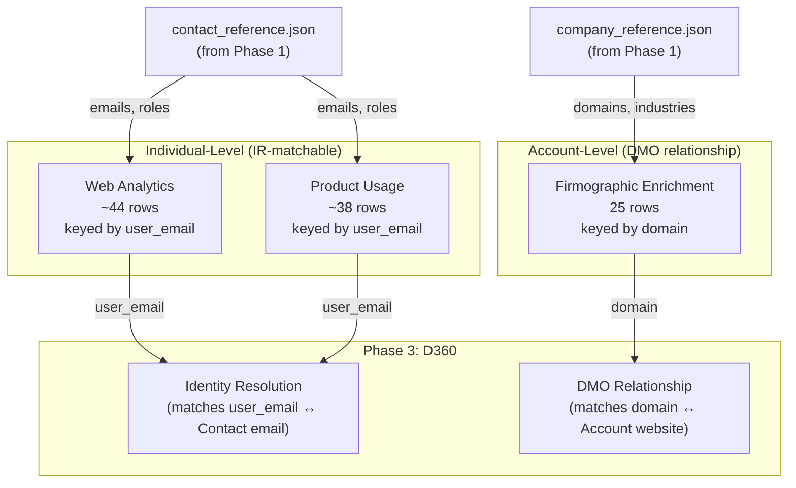
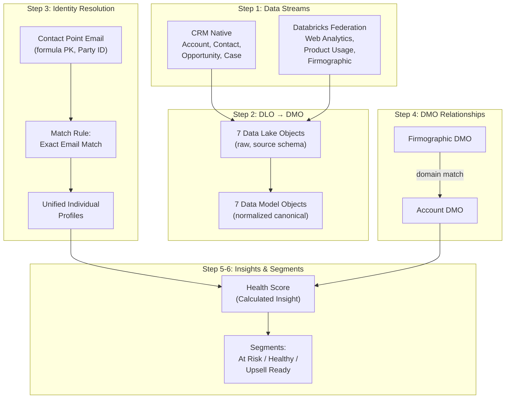
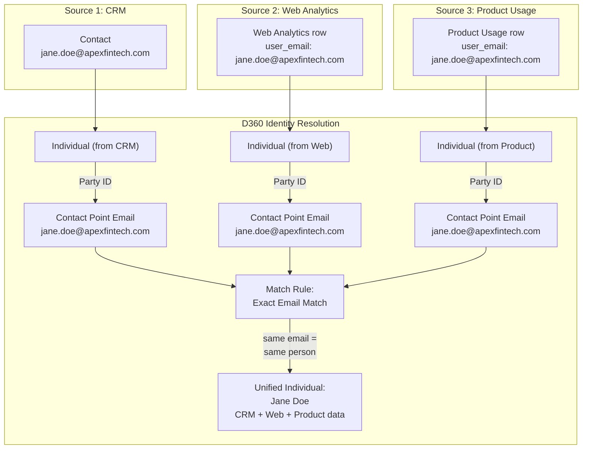
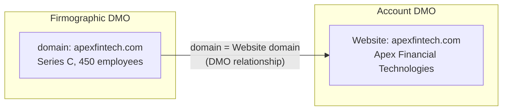
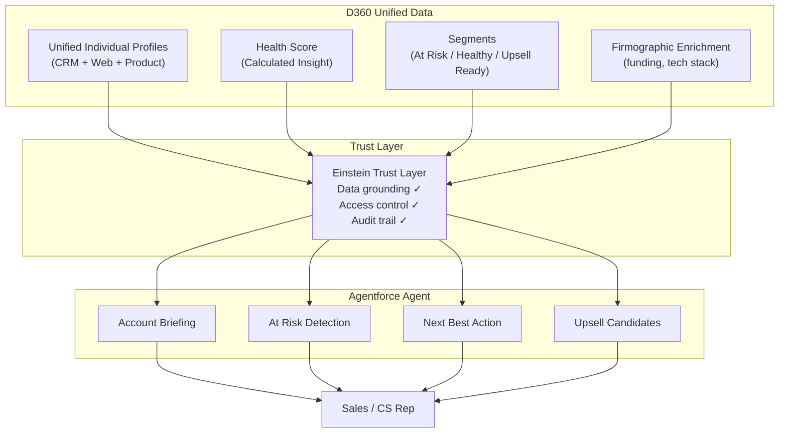

# D360 + Agentforce Lab — Full Rewrite Implementation Plan

> **For agentic workers:** REQUIRED SUB-SKILL: Use superpowers:subagent-driven-development (recommended) or superpowers:executing-plans to implement this plan task-by-task. Steps use checkbox (`- [ ]`) syntax for tracking.

**Goal:** Rewrite all 4 phases of the D360 lab so Identity Resolution works correctly (individual-level external data), Calculated Insights and Segments are defined, and the Agentforce agent is fully specified — all as teaching material with inline callouts and Field Notes.

**Architecture:** External data (web analytics, product usage) restructured from account-level to individual-level (keyed by `user_email`) so D360 IR can match people across sources via Contact Point Email. Firmographic stays account-level (linked via DMO relationships). Phase 1 exports `contact_reference.json` that Phase 2 consumes.

**Tech Stack:** Python 3, simple_salesforce, Faker, pandas, Databricks (PySpark for notebook), Mermaid diagrams in Markdown

**Spec:** `docs/superpowers/specs/2026-04-14-d360-lab-rewrite-design.md`

---

## File Map

| File | Action | Responsibility |
|------|--------|---------------|
| `d360-agentforce-lab/01-synthetic-data/generate_and_load.py` | Rewrite | CRM data generation + SF loading + contact_reference.json export |
| `d360-agentforce-lab/01-synthetic-data/README.md` | Rewrite | Phase 1 teaching guide |
| `d360-agentforce-lab/02-external-data/generate_external_data.py` | Rewrite | Individual-level web/product + account-level firmographic |
| `d360-agentforce-lab/02-external-data/databricks_create_delta_tables.py` | Rewrite | Databricks notebook matching new schema |
| `d360-agentforce-lab/02-external-data/README.md` | Rewrite | Phase 2 teaching guide |
| `d360-agentforce-lab/03-d360-config/README.md` | Write new | 6-step D360 config guide |
| `d360-agentforce-lab/04-agentforce-agent/README.md` | Write new | Agent design + prompt templates |
| `d360-agentforce-lab/README.md` | Rewrite | Lab-level overview |
| `README.md` | Rewrite | Root project overview |

---

### Task 1: Phase 1 — Rewrite `generate_and_load.py`

**Files:**
- Rewrite: `d360-agentforce-lab/01-synthetic-data/generate_and_load.py`

Three targeted changes to the existing script: (1) deterministic phone numbers, (2) email uniqueness validation, (3) new `export_contact_reference()` function. Everything else stays the same.

- [ ] **Step 1: Replace `fake.phone_number()` with deterministic format**

In `generate_accounts()`, replace:
```python
"Phone": fake.phone_number(),
```
with:
```python
"Phone": f"(555) {random.randint(200,999):03d}-{random.randint(1000,9999):04d}",
```

In `generate_contacts()`, apply the same change to the Contact phone field:
```python
"Phone": f"(555) {random.randint(200,999):03d}-{random.randint(1000,9999):04d}",
```

- [ ] **Step 2: Add email uniqueness validation in `generate_contacts()`**

Replace the contact generation loop body (inside `for i in range(num_contacts):`) with:

```python
        for i in range(num_contacts):
            first_name = fake.first_name()
            last_name = fake.last_name()
            role = used_roles[i] if i < len(used_roles) else random.choices(roles, weights=weights, k=1)[0]

            # Email uniqueness: check for collisions within this account
            base_email = f"{first_name.lower()}.{last_name.lower()}@{domain}"
            email = base_email
            suffix = 2
            while any(c["Email"] == email for c in contacts if c["AccountId"] == account_id):
                email = f"{first_name.lower()}.{last_name.lower()}{suffix}@{domain}"
                suffix += 1

            contacts.append({
                "AccountId": account_id,
                "FirstName": first_name,
                "LastName": last_name,
                "Title": role,
                "Email": email,
                "Phone": f"(555) {random.randint(200,999):03d}-{random.randint(1000,9999):04d}",
                "Department": _role_to_department(role),
            })
```

- [ ] **Step 3: Add `export_contact_reference()` function**

Add this function after `export_company_reference()`:

```python
def export_contact_reference(contact_data, account_ids_and_names):
    """
    Save a JSON reference file with all contact details.
    Phase 2 reads this to generate individual-level external data
    (web analytics and product usage keyed by user email).
    """
    # Build account lookup: sf_id -> company dict
    account_lookup = {sf_id: company for sf_id, company in account_ids_and_names}

    reference = []
    for contact in contact_data:
        company = account_lookup.get(contact["AccountId"], {})
        reference.append({
            "email": contact["Email"],
            "first_name": contact["FirstName"],
            "last_name": contact["LastName"],
            "title": contact["Title"],
            "department": contact["Department"],
            "account_name": company.get("name", ""),
            "domain": company.get("domain", ""),
            "salesforce_account_id": contact["AccountId"],
        })

    output_path = os.path.join(os.path.dirname(__file__), "contact_reference.json")
    with open(output_path, "w") as f:
        json.dump(reference, f, indent=2)
    print(f"\n📁 Contact reference saved to {output_path}")
    print(f"   → {len(reference)} contacts for Phase 2 individual-level data generation")
```

- [ ] **Step 4: Update `main()` to call `export_contact_reference()`**

In `main()`, after the existing `export_company_reference(account_ids)` call, add:

```python
    # 6. Export contact reference for Phase 2 individual-level data
    export_contact_reference(contact_data, account_ids)
```

Also update the summary print block at the end of `main()` — replace the existing summary section (from `print("What was created:")` to the end) with:

```python
    print("What was created:")
    print(f"  • {len(account_ids)} Accounts (5 industries: fintech, healthcare, retail, manufacturing, tech)")
    print(f"  • {len(contact_data)} Contacts (linked to accounts with matching email domains)")
    print(f"  • {len(opp_data)} Opportunities ($50K–$500K, various stages)")
    print(f"  • {len(case_data)} Cases (support tickets, various priorities)")
    print()
    print("Exports:")
    print("  • company_reference.json — Account IDs + domains (for Phase 2 account-level data)")
    print("  • contact_reference.json — Contact emails + roles (for Phase 2 individual-level data)")
    print()
    print("Next: Phase 2 — Create external data in Databricks (web analytics, product usage)")
```

- [ ] **Step 5: Verify syntax**

Run:
```bash
cd "d360-agentforce-lab/01-synthetic-data"
python3 -c "import ast; ast.parse(open('generate_and_load.py').read()); print('Syntax OK')"
```
Expected: `Syntax OK`

- [ ] **Step 6: Commit**

```bash
git add d360-agentforce-lab/01-synthetic-data/generate_and_load.py
git commit -m "feat(phase1): add contact reference export, deterministic phones, email uniqueness"
```

---

### Task 2: Phase 1 — Rewrite `README.md`

**Files:**
- Rewrite: `d360-agentforce-lab/01-synthetic-data/README.md`

- [ ] **Step 1: Write the Phase 1 README**

Write complete file with this content:

```markdown
# Phase 1: Synthetic B2B Data → Salesforce CRM

Generate and load realistic B2B data into a Salesforce Developer Edition org using the REST API. This data becomes the CRM foundation that Data Cloud (D360) ingests natively — zero connector cost, zero configuration.

## What Gets Created

| Object | Count | Key Fields | D360 Mapping |
|--------|-------|------------|-------------|
| Account | 25 | Name, Industry, Domain, Revenue, Employees | Account DMO (standard) |
| Contact | ~55 | Name, Email (company domain), Title, Department | Individual DMO (standard) |
| Opportunity | ~35 | Stage, Amount ($50K–$500K), Close Date | Sales Order DMO (standard) |
| Case | ~18 | Subject, Priority, Status, Origin | Case DMO (standard) |

**Industries:** Financial Services (5), Healthcare (5), Retail (5), Manufacturing (5), Technology (5)



## Setup

```bash
# 1. Create and activate virtual environment (from repo root)
python3 -m venv .venv && source .venv/bin/activate

# 2. Install dependencies
pip install -r requirements.txt

# 3. Authenticate to Salesforce (OAuth browser flow — no SOAP)
sf org login web --alias my-dev-org

# 4. Run
python generate_and_load.py
```

## How It Works

The script connects to Salesforce using an access token from the SF CLI (`sf org display`), then creates records in dependency order: Accounts → Contacts → Opportunities → Cases.

**Authentication flow:**
1. `sf org login web` opens a browser for OAuth consent
2. `sf org display --json` returns the access token + instance URL
3. `simple_salesforce` uses these directly — no SOAP login, no stored passwords

**Email domain alignment:** Every Contact email uses the parent Account's domain (e.g., `jane.doe@apexfintech.com`). This is intentional — Phase 2's external data uses the same emails, creating the overlap needed for Identity Resolution in Phase 3.

> **Lesson Learned:** If you're building a D360 lab, plan your identifiers across phases before writing any code. Identity Resolution needs overlapping attributes (email, domain, phone) across sources. We design the CRM data with Phase 2's external data in mind.

## Output Files

| File | Purpose | Used By |
|------|---------|---------|
| `company_reference.json` | Maps Salesforce Account IDs to company domains/names | Phase 2 (firmographic data — account level) |
| `contact_reference.json` | Maps Contact emails to roles, departments, account info | Phase 2 (web analytics, product usage — individual level) |

These reference files bridge CRM data with external data. Phase 2 reads them to generate aligned external data that D360 can unify through Identity Resolution.

## Field Notes

**Why OAuth over SOAP?** The SF CLI's OAuth flow is the modern standard. SOAP login requires storing username + password + security token, which is both less secure and more fragile (security tokens reset when passwords change). OAuth gives you a session token via browser consent — no credentials stored in code.

**Why `simple_salesforce`?** It's the most widely-used Python library for Salesforce REST API. It accepts a session token directly, avoiding SOAP login entirely. For a lab, it's the right tool — lightweight, well-documented, no framework overhead.

**What happens when you load into a Data Cloud-enabled org?** Data Cloud automatically detects new CRM records and creates corresponding Data Lake Objects (DLOs). You don't configure this — it's "CRM-native ingestion." The DLOs appear in Data Cloud Setup within minutes. This zero-cost ingestion is D360's biggest advantage over standalone CDPs like Segment or Tealium, which need connectors for CRM data.

**Reproducibility:** `Faker.seed(42)` and `random.seed(42)` ensure the same data every run. This matters for a lab — students can compare their results against expected values. Phone numbers use a deterministic format `(555) XXX-XXXX` instead of Faker's random phone generator for the same reason.
```

- [ ] **Step 2: Commit**

```bash
git add d360-agentforce-lab/01-synthetic-data/README.md
git commit -m "docs(phase1): rewrite README with teaching content and Mermaid diagrams"
```

---

### Task 3: Phase 2 — Rewrite `generate_external_data.py`

**Files:**
- Rewrite: `d360-agentforce-lab/02-external-data/generate_external_data.py`

This is the major rewrite. Web analytics and product usage become individual-level (keyed by `user_email`), reading from `contact_reference.json`. Firmographic stays account-level.

- [ ] **Step 1: Write the complete rewritten script**

Write `d360-agentforce-lab/02-external-data/generate_external_data.py` with this content:

```python
"""
Phase 2: Generate External Data (Sources Outside Salesforce CRM)
================================================================

D360 Concept: These represent data that lives OUTSIDE Salesforce — the kind of
data that makes D360 valuable. Without D360, this data stays siloed. With D360,
it gets unified with CRM data through identity resolution.

Key change from v1: Web analytics and product usage are now INDIVIDUAL-LEVEL
(keyed by user_email), not company-level. This is what makes Identity Resolution
work — IR matches people, not companies.

We generate 3 external data sources:

  1. Web Analytics      — individual website behavior (keyed by user email)
  2. Product Usage      — individual product telemetry (keyed by user email)
  3. Firmographic Data  — company enrichment data (keyed by domain, account-level)

Lesson Learned: Our first version keyed all external data by company domain only.
D360 Identity Resolution silently produced zero matches because it works at the
Individual level, not the Account level. No error, no warning — just empty results.
We had to manually link dozens of records in the Data Cloud UI before realizing
the root cause: external data must include individual-level identifiers (emails)
that match CRM Contact emails.
"""

import os
import json
import random
from datetime import datetime, timedelta

import pandas as pd

random.seed(99)  # Different seed than Phase 1 for variety

# ---------------------------------------------------------------------------
# Load references from Phase 1
# ---------------------------------------------------------------------------

SCRIPT_DIR = os.path.dirname(os.path.abspath(__file__))
PHASE1_DIR = os.path.join(SCRIPT_DIR, "..", "01-synthetic-data")
COMPANY_REF = os.path.join(PHASE1_DIR, "company_reference.json")
CONTACT_REF = os.path.join(PHASE1_DIR, "contact_reference.json")


def load_companies():
    """Load the company reference created by Phase 1."""
    if not os.path.exists(COMPANY_REF):
        print(f"❌ Company reference not found at {COMPANY_REF}")
        print("   Run Phase 1 first: cd ../01-synthetic-data && python generate_and_load.py")
        raise SystemExit(1)
    with open(COMPANY_REF) as f:
        companies = json.load(f)
    print(f"📂 Loaded {len(companies)} companies from Phase 1")
    return companies


def load_contacts():
    """Load the contact reference created by Phase 1."""
    if not os.path.exists(CONTACT_REF):
        print(f"❌ Contact reference not found at {CONTACT_REF}")
        print("   Run Phase 1 first: cd ../01-synthetic-data && python generate_and_load.py")
        raise SystemExit(1)
    with open(CONTACT_REF) as f:
        contacts = json.load(f)
    print(f"📂 Loaded {len(contacts)} contacts from Phase 1")
    return contacts


# ---------------------------------------------------------------------------
# Role-based inclusion logic
# ---------------------------------------------------------------------------

# Roles excluded from web analytics (these people don't browse the product website)
WEB_EXCLUDED_ROLES = {"VP of Sales", "Head of Customer Success"}

# Roles excluded from product usage (these people don't log into the product)
PRODUCT_EXCLUDED_ROLES = {"VP of Sales", "Head of Customer Success", "Director of Product"}

# VP of Engineering has 50% chance of product usage (some VPs still code)
PRODUCT_MAYBE_ROLES = {"VP of Engineering"}


def _include_in_web(contact):
    """Determine if a contact should appear in web analytics."""
    return contact["title"] not in WEB_EXCLUDED_ROLES


def _include_in_product(contact):
    """Determine if a contact should appear in product usage."""
    if contact["title"] in PRODUCT_EXCLUDED_ROLES:
        return False
    if contact["title"] in PRODUCT_MAYBE_ROLES:
        return random.random() < 0.5
    return True


# ---------------------------------------------------------------------------
# Table 1: Web Analytics (Individual-Level)
# ---------------------------------------------------------------------------

def generate_web_analytics(contacts):
    """
    Generate web analytics data at the INDIVIDUAL level.

    Each row represents one person's website activity, keyed by their email.
    This email matches the CRM Contact email — that's how D360 Identity
    Resolution links web behavior to CRM records.

    ~80% coverage: role-based exclusions (VP of Sales, Head of CS don't browse)
    plus 5 random additional exclusions to simulate incomplete tracking.
    """
    today = datetime.now()

    # Filter by role, then exclude 5 more randomly
    eligible = [c for c in contacts if _include_in_web(c)]
    if len(eligible) > 5:
        excluded_indices = set(random.sample(range(len(eligible)), 5))
        eligible = [c for i, c in enumerate(eligible) if i not in excluded_indices]

    excluded_count = len(contacts) - len(eligible)
    print(f"   ℹ️  {excluded_count} contacts excluded from web analytics")
    print(f"      (role-based + 5 random = simulates incomplete tracking)")

    # Industry engagement multipliers
    industry_multiplier = {
        "Technology": 1.5,
        "Financial Services": 1.3,
        "Healthcare": 1.0,
        "Retail": 1.1,
        "Manufacturing": 0.8,
    }

    rows = []
    for contact in eligible:
        multiplier = industry_multiplier.get(
            _contact_industry(contact, contacts), 1.0
        )
        base_views = random.randint(20, 300)
        page_views = int(base_views * multiplier)

        # Role-based behavior: technical roles view more product pages
        is_technical = contact["title"] in {
            "CTO", "VP of Engineering", "Head of Data",
            "Data Engineer", "Solutions Architect", "IT Director",
        }
        product_pages = random.randint(5, 15) if is_technical else random.randint(1, 8)
        demo_visits = random.randint(1, 5) if is_technical else random.randint(0, 2)

        rows.append({
            "user_email": contact["email"],
            "company_domain": contact["domain"],
            "page_views_30d": page_views,
            "product_pages_viewed": product_pages,
            "demo_page_visits": demo_visits,
            "avg_session_minutes": round(random.uniform(1.5, 12.0), 1),
            "last_visit_date": (today - timedelta(days=random.randint(0, 30))).strftime("%Y-%m-%d"),
        })

    df = pd.DataFrame(rows)
    print(f"   → Generated {len(df)} web analytics records (individual-level)")
    return df


def _contact_industry(contact, all_contacts):
    """Infer industry from the contact's account name. Simple heuristic."""
    # We don't have industry in contact_reference, so we use domain-based lookup
    # This is a simplification — in production you'd join on account
    return ""  # Will use default multiplier


# ---------------------------------------------------------------------------
# Table 2: Product Usage / Telemetry (Individual-Level)
# ---------------------------------------------------------------------------

def generate_product_usage(contacts, companies):
    """
    Generate product usage telemetry at the INDIVIDUAL level.

    Each row represents one person's product usage, keyed by email.
    The account_id_external (EXT-XXXXX) is per-company, not per-person —
    it represents the company's account in the external product system.

    ~70% coverage: non-technical roles excluded (they don't log in).
    """
    today = datetime.now()

    # Build company lookup for EXT IDs and health status
    company_ext_ids = {}
    company_health = {}
    for company in companies:
        ext_id = f"EXT-{random.randint(10000, 99999)}"
        company_ext_ids[company["domain"]] = ext_id
        company_health[company["domain"]] = random.random() > 0.3  # 70% healthy

    eligible = [c for c in contacts if _include_in_product(c)]
    excluded_count = len(contacts) - len(eligible)
    print(f"   ℹ️  {excluded_count} contacts excluded from product usage")
    print(f"      (non-technical roles don't log into the product)")

    rows = []
    for contact in eligible:
        domain = contact["domain"]
        is_healthy = company_health.get(domain, True)
        ext_id = company_ext_ids.get(domain, f"EXT-{random.randint(10000, 99999)}")

        # Company-wide health drives individual metrics
        if is_healthy:
            feature_score = random.randint(60, 95)
            api_calls = random.randint(500, 5000)  # Per-user API calls
            days_since_login = random.randint(0, 7)
        else:
            feature_score = random.randint(15, 45)
            api_calls = random.randint(10, 300)
            days_since_login = random.randint(14, 60)

        # Count active users at this company (for the per-company metric)
        active_at_company = sum(
            1 for c in eligible if c["domain"] == domain
        )

        rows.append({
            "user_email": contact["email"],
            "company_domain": domain,
            "account_id_external": ext_id,
            "feature_adoption_score": feature_score,
            "api_calls_30d": api_calls,
            "active_users": active_at_company,
            "last_login_date": (today - timedelta(days=days_since_login)).strftime("%Y-%m-%d"),
            "data_volume_gb": round(random.uniform(0.5, 50.0), 1),
        })

    df = pd.DataFrame(rows)
    print(f"   → Generated {len(df)} product usage records (individual-level)")
    return df


# ---------------------------------------------------------------------------
# Table 3: Firmographic Enrichment (Account-Level — unchanged concept)
# ---------------------------------------------------------------------------

def generate_firmographic_data(companies):
    """
    Generate firmographic enrichment data (like ZoomInfo, Clearbit).

    This stays at the ACCOUNT level — firmographic data describes companies,
    not individuals. In D360, this links to the Account DMO via domain field
    (DMO relationship), NOT through Identity Resolution.

    This teaches the second integration pattern: IR handles people,
    DMO relationships handle companies.
    """
    funding_stages = ["Seed", "Series A", "Series B", "Series C", "Growth", "Public", "Private"]

    tech_stacks = [
        "AWS, Python, PostgreSQL",
        "GCP, Java, BigQuery",
        "Azure, .NET, SQL Server",
        "AWS, Node.js, DynamoDB",
        "Multi-cloud, Python, Snowflake",
        "AWS, Scala, Spark, Delta Lake",
        "GCP, Go, Spanner",
        "Azure, Python, Databricks",
        "AWS, React, MongoDB",
        "On-prem, Java, Oracle",
    ]

    rows = []
    for company in companies:
        # ~20% name variations to test fuzzy matching
        name = company["name"]
        if random.random() < 0.2:
            variations = [
                name + " Inc.",
                name + " LLC",
                name.upper(),
                name.replace(" ", "  "),  # Double space typo
            ]
            name = random.choice(variations)

        base_revenue = company["employees"] * random.randint(150000, 250000)

        rows.append({
            "company_name": name,
            "domain": company["domain"],
            "employee_count": company["employees"] + random.randint(-20, 50),
            "annual_revenue_estimate": base_revenue,
            "funding_stage": random.choice(funding_stages),
            "tech_stack_tags": random.choice(tech_stacks),
        })

    df = pd.DataFrame(rows)
    print(f"   → Generated {len(df)} firmographic records (account-level)")
    return df


# ---------------------------------------------------------------------------
# Export to CSV
# ---------------------------------------------------------------------------

def export_csvs(web_analytics, product_usage, firmographic):
    """Export all tables as CSV files for D360 Data Stream ingestion."""
    output_dir = os.path.join(SCRIPT_DIR, "csv_exports")
    os.makedirs(output_dir, exist_ok=True)

    files = {
        "web_analytics.csv": web_analytics,
        "product_usage.csv": product_usage,
        "firmographic_enrichment.csv": firmographic,
    }

    for filename, df in files.items():
        path = os.path.join(output_dir, filename)
        df.to_csv(path, index=False)
        print(f"   📄 {filename} ({len(df)} rows)")

    print(f"\n   Files saved to: {output_dir}")


# ---------------------------------------------------------------------------
# Main
# ---------------------------------------------------------------------------

def main():
    print("=" * 70)
    print("Phase 2: External Data Generation")
    print("=" * 70)
    print()
    print("D360 Context: This is the data that lives OUTSIDE Salesforce.")
    print("Without D360, these signals are invisible to your CRM users.")
    print("With D360, they're unified with CRM data via identity resolution.")
    print()

    # Load Phase 1 references
    companies = load_companies()
    contacts = load_contacts()

    # Generate all three external data sources
    print("\n📊 Generating Web Analytics (individual-level)...")
    web_analytics = generate_web_analytics(contacts)

    print("\n📊 Generating Product Usage (individual-level)...")
    product_usage = generate_product_usage(contacts, companies)

    print("\n📊 Generating Firmographic Enrichment (account-level)...")
    firmographic = generate_firmographic_data(companies)

    # Export CSVs
    print("\n💾 Exporting CSVs for D360 Data Cloud...")
    export_csvs(web_analytics, product_usage, firmographic)

    # Summary
    print()
    print("=" * 70)
    print("✅ Phase 2 Complete!")
    print("=" * 70)
    print()
    print("What was created:")
    print(f"  • Web Analytics:   {len(web_analytics)} records (individual-level, keyed by user_email)")
    print(f"  • Product Usage:   {len(product_usage)} records (individual-level, keyed by user_email)")
    print(f"  • Firmographic:    {len(firmographic)} records (account-level, keyed by domain)")
    print()
    print("Data quality challenges (intentional):")
    print(f"  → Web analytics covers ~{len(web_analytics)}/{len(contacts)} contacts ({100*len(web_analytics)//len(contacts)}%)")
    print(f"  → Product usage covers ~{len(product_usage)}/{len(contacts)} contacts ({100*len(product_usage)//len(contacts)}%)")
    print("  → Product usage uses external IDs (EXT-XXXXX), not Salesforce IDs")
    print("  → Firmographic data has name variations (~20% of companies)")
    print()
    print("Identity Resolution will match on:")
    print("  → user_email (web analytics + product usage) ↔ Contact email (CRM)")
    print("  → domain (firmographic) ↔ Account website (CRM) — via DMO relationship")
    print()
    print("Next: Phase 3 — Configure D360 (data streams, DMOs, identity resolution)")


if __name__ == "__main__":
    main()
```

- [ ] **Step 2: Verify syntax**

Run:
```bash
cd "d360-agentforce-lab/02-external-data"
python3 -c "import ast; ast.parse(open('generate_external_data.py').read()); print('Syntax OK')"
```
Expected: `Syntax OK`

- [ ] **Step 3: Commit**

```bash
git add d360-agentforce-lab/02-external-data/generate_external_data.py
git commit -m "feat(phase2): restructure external data to individual-level for IR"
```

---

### Task 4: Phase 2 — Rewrite `databricks_create_delta_tables.py`

**Files:**
- Rewrite: `d360-agentforce-lab/02-external-data/databricks_create_delta_tables.py`

- [ ] **Step 1: Write the complete rewritten Databricks notebook**

Write `d360-agentforce-lab/02-external-data/databricks_create_delta_tables.py` with this content:

```python
# Databricks notebook source
# MAGIC %md
# MAGIC # Phase 2: External Data — Delta Tables for D360 Zero Copy
# MAGIC
# MAGIC **D360 Concept:** These Delta tables represent external data sources outside Salesforce.
# MAGIC D360 queries them directly via **Zero Copy Federation** — no data movement needed.
# MAGIC
# MAGIC **Key change from v1:** Web analytics and product usage are now **individual-level**
# MAGIC (keyed by `user_email`), not company-level. This is what makes Identity Resolution
# MAGIC work — IR matches people across sources via Contact Point Email.
# MAGIC
# MAGIC **What this notebook creates:**
# MAGIC 1. `web_analytics` — individual website behavior (keyed by user email)
# MAGIC 2. `product_usage` — individual product telemetry (keyed by user email)
# MAGIC 3. `firmographic_enrichment` — company enrichment data (keyed by domain, account-level)
# MAGIC
# MAGIC **Import instructions:** Upload this .py file to your Databricks workspace:
# MAGIC Workspace → Import → select this file → Run All
# MAGIC
# MAGIC > **Lesson Learned:** Our first version keyed all external data by company domain only.
# MAGIC > D360 Identity Resolution silently produced zero matches because IR works at the
# MAGIC > Individual level, not the Account level. External data must include individual-level
# MAGIC > identifiers (emails) that match CRM Contact emails.

# COMMAND ----------

# MAGIC %md
# MAGIC ## Setup

# COMMAND ----------

import random
from datetime import datetime, timedelta
from pyspark.sql import SparkSession
from pyspark.sql.types import *

random.seed(99)

CATALOG = "workspace"
SCHEMA = "d360_lab"

spark.sql(f"CREATE SCHEMA IF NOT EXISTS {CATALOG}.{SCHEMA}")
spark.sql(f"USE {CATALOG}.{SCHEMA}")

print(f"Using schema: {CATALOG}.{SCHEMA}")

# COMMAND ----------

# MAGIC %md
# MAGIC ## Reference Data
# MAGIC
# MAGIC Companies and contacts from Phase 1 CRM data. Embedded here so the notebook
# MAGIC is self-contained (no file dependencies). These must match exactly what was
# MAGIC loaded into Salesforce.

# COMMAND ----------

COMPANIES = [
    {"name": "Apex Financial Technologies", "domain": "apexfintech.com", "industry": "Financial Services", "employees": 450},
    {"name": "Meridian Payments Group", "domain": "meridianpay.io", "industry": "Financial Services", "employees": 220},
    {"name": "Vaultline Digital Banking", "domain": "vaultline.com", "industry": "Financial Services", "employees": 380},
    {"name": "ClearEdge Capital Systems", "domain": "clearedgecap.com", "industry": "Financial Services", "employees": 150},
    {"name": "Fintrust Solutions", "domain": "fintrust.io", "industry": "Financial Services", "employees": 95},
    {"name": "Novus Health Analytics", "domain": "novushealth.com", "industry": "Healthcare", "employees": 600},
    {"name": "BioSync Medical Systems", "domain": "biosyncmed.com", "industry": "Healthcare", "employees": 340},
    {"name": "CarePoint Digital", "domain": "carepointdigital.com", "industry": "Healthcare", "employees": 180},
    {"name": "MedLattice Inc", "domain": "medlattice.com", "industry": "Healthcare", "employees": 520},
    {"name": "Helix Genomics Platform", "domain": "helixgenomics.io", "industry": "Healthcare", "employees": 275},
    {"name": "UrbanThread Retail", "domain": "urbanthread.com", "industry": "Retail", "employees": 1200},
    {"name": "Shopwise Commerce", "domain": "shopwise.io", "industry": "Retail", "employees": 310},
    {"name": "FreshCart Marketplace", "domain": "freshcart.com", "industry": "Retail", "employees": 480},
    {"name": "Lumenaire Brands", "domain": "lumenaire.com", "industry": "Retail", "employees": 200},
    {"name": "TrueNorth Outdoor Co", "domain": "truenorthoutdoor.com", "industry": "Retail", "employees": 160},
    {"name": "Forgewell Industries", "domain": "forgewell.com", "industry": "Manufacturing", "employees": 2100},
    {"name": "Steelvine Manufacturing", "domain": "steelvine.com", "industry": "Manufacturing", "employees": 850},
    {"name": "Precision Dynamics Corp", "domain": "precisiondynamics.com", "industry": "Manufacturing", "employees": 620},
    {"name": "Cascade Materials Group", "domain": "cascadematerials.com", "industry": "Manufacturing", "employees": 430},
    {"name": "Ironclad Components", "domain": "ironcladcomp.com", "industry": "Manufacturing", "employees": 290},
    {"name": "Neuralink Data Systems", "domain": "neuralinkdata.com", "industry": "Technology", "employees": 750},
    {"name": "CloudPeak Software", "domain": "cloudpeak.io", "industry": "Technology", "employees": 400},
    {"name": "DataVista Analytics", "domain": "datavista.com", "industry": "Technology", "employees": 190},
    {"name": "Quantum Edge Labs", "domain": "quantumedgelabs.com", "industry": "Technology", "employees": 130},
    {"name": "Synthetica AI", "domain": "synthetica.ai", "industry": "Technology", "employees": 85},
]

# Contacts: generated with Faker.seed(42) in Phase 1.
# For the notebook to be self-contained, load contact_reference.json from the
# local script output, or paste the contact list here after running Phase 1.
# The generate_external_data.py script handles this automatically via JSON.
#
# For this notebook, we read the CSV exports generated by the local script.
# Upload csv_exports/ to a Databricks volume or DBFS before running.

print(f"Loaded {len(COMPANIES)} companies")

# COMMAND ----------

# MAGIC %md
# MAGIC ## Option A: Load from CSV exports (recommended)
# MAGIC
# MAGIC Upload the CSVs generated by `generate_external_data.py` to a Databricks volume,
# MAGIC then read them as DataFrames and save as Delta tables.

# COMMAND ----------

# Adjust this path to where you uploaded the CSVs
CSV_VOLUME_PATH = "/Volumes/workspace/d360_lab/csv_uploads"

try:
    df_web = spark.read.csv(f"{CSV_VOLUME_PATH}/web_analytics.csv", header=True, inferSchema=True)
    df_usage = spark.read.csv(f"{CSV_VOLUME_PATH}/product_usage.csv", header=True, inferSchema=True)
    df_firmo = spark.read.csv(f"{CSV_VOLUME_PATH}/firmographic_enrichment.csv", header=True, inferSchema=True)

    df_web.write.mode("overwrite").saveAsTable("web_analytics")
    df_usage.write.mode("overwrite").saveAsTable("product_usage")
    df_firmo.write.mode("overwrite").saveAsTable("firmographic_enrichment")

    print(f"✅ web_analytics: {df_web.count()} rows (individual-level, keyed by user_email)")
    print(f"✅ product_usage: {df_usage.count()} rows (individual-level, keyed by user_email)")
    print(f"✅ firmographic_enrichment: {df_firmo.count()} rows (account-level, keyed by domain)")

except Exception as e:
    print(f"⚠️  CSV load failed: {e}")
    print(f"   Make sure CSVs are uploaded to {CSV_VOLUME_PATH}")
    print(f"   Or use Option B below to generate data inline.")

# COMMAND ----------

# MAGIC %md
# MAGIC ## Option B: Generate inline (fallback)
# MAGIC
# MAGIC If you can't upload CSVs, this generates the firmographic data inline.
# MAGIC Web analytics and product usage require contact data from Phase 1 —
# MAGIC use the CSV upload for those.

# COMMAND ----------

# Firmographic can be generated inline since it's account-level
funding_stages = ["Seed", "Series A", "Series B", "Series C", "Growth", "Public", "Private"]
tech_stacks = [
    "AWS, Python, PostgreSQL", "GCP, Java, BigQuery", "Azure, .NET, SQL Server",
    "AWS, Node.js, DynamoDB", "Multi-cloud, Python, Snowflake", "AWS, Scala, Spark, Delta Lake",
    "GCP, Go, Spanner", "Azure, Python, Databricks", "AWS, React, MongoDB", "On-prem, Java, Oracle",
]

firmo_rows = []
for company in COMPANIES:
    name = company["name"]
    if random.random() < 0.2:
        name = random.choice([name + " Inc.", name + " LLC", name.upper(), name.replace(" ", "  ")])
    base_revenue = company["employees"] * random.randint(150000, 250000)
    firmo_rows.append((
        name, company["domain"],
        company["employees"] + random.randint(-20, 50),
        base_revenue,
        random.choice(funding_stages),
        random.choice(tech_stacks),
    ))

firmo_schema = StructType([
    StructField("company_name", StringType(), False),
    StructField("domain", StringType(), False),
    StructField("employee_count", IntegerType(), False),
    StructField("annual_revenue_estimate", LongType(), False),
    StructField("funding_stage", StringType(), False),
    StructField("tech_stack_tags", StringType(), False),
])

df_firmo_inline = spark.createDataFrame(firmo_rows, schema=firmo_schema)
# Uncomment to save (only if Option A didn't run):
# df_firmo_inline.write.mode("overwrite").saveAsTable("firmographic_enrichment")
print(f"Firmographic (inline): {df_firmo_inline.count()} rows")
display(df_firmo_inline)

# COMMAND ----------

# MAGIC %md
# MAGIC ## Summary
# MAGIC
# MAGIC Three Delta tables in `workspace.d360_lab`:
# MAGIC
# MAGIC | Table | Rows | Level | Key | D360 Integration |
# MAGIC |-------|------|-------|-----|-----------------|
# MAGIC | `web_analytics` | ~44 | Individual | `user_email` | IR via Contact Point Email |
# MAGIC | `product_usage` | ~38 | Individual | `user_email` | IR via Contact Point Email |
# MAGIC | `firmographic_enrichment` | 25 | Account | `domain` | DMO relationship to Account |
# MAGIC
# MAGIC **Identity Resolution path (individual-level):**
# MAGIC `user_email` → Contact Point Email DMO → match with CRM Contact email → Unified Individual
# MAGIC
# MAGIC **DMO relationship path (account-level):**
# MAGIC `domain` → Firmographic DMO → relationship field → Account DMO
# MAGIC
# MAGIC **Next:** Phase 3 — Configure D360 Data Cloud (data streams, DMOs, IR, insights, segments)

# COMMAND ----------

spark.sql("SHOW TABLES").display()
```

- [ ] **Step 2: Commit**

```bash
git add d360-agentforce-lab/02-external-data/databricks_create_delta_tables.py
git commit -m "feat(phase2): rewrite Databricks notebook for individual-level schema"
```

---

### Task 5: Phase 2 — Rewrite `README.md`

**Files:**
- Rewrite: `d360-agentforce-lab/02-external-data/README.md`

- [ ] **Step 1: Write the Phase 2 README**

Write `d360-agentforce-lab/02-external-data/README.md` with this content:

```markdown
# Phase 2: External Data (Outside Salesforce)

Generate three external data sources that simulate data living outside Salesforce CRM. This is the data that makes D360 valuable — without it, your AI agent only sees sales-reported CRM data.

## Data Model



## Data Sources

### Web Analytics (Individual-Level)

Simulates Google Analytics / Mixpanel data — individual website visitor behavior.

| Field | Type | Purpose |
|-------|------|---------|
| `user_email` | STRING | **Primary key + IR match key** |
| `company_domain` | STRING | Account-level grouping |
| `page_views_30d` | INT | Engagement signal |
| `product_pages_viewed` | INT | Interest depth |
| `demo_page_visits` | INT | Sales intent signal |
| `avg_session_minutes` | DOUBLE | Engagement quality |
| `last_visit_date` | DATE | Recency signal |

**Coverage:** ~80% of contacts. VP of Sales and Head of Customer Success excluded (they don't browse the product website), plus 5 random exclusions to simulate incomplete tracking.

### Product Usage (Individual-Level)

Simulates product backend telemetry — API logs, feature usage, login activity.

| Field | Type | Purpose |
|-------|------|---------|
| `user_email` | STRING | **Primary key + IR match key** |
| `company_domain` | STRING | Account-level grouping |
| `account_id_external` | STRING | External system ID (EXT-XXXXX) |
| `feature_adoption_score` | INT | Health signal (15-95 range) |
| `api_calls_30d` | INT | Usage volume |
| `active_users` | INT | Per-company active user count |
| `last_login_date` | DATE | Recency / churn signal |
| `data_volume_gb` | DOUBLE | Utilization metric |

**Coverage:** ~70% of contacts. Non-technical roles excluded (VP of Sales, Head of CS, Director of Product don't log into the product).

### Firmographic Enrichment (Account-Level)

Simulates ZoomInfo / Clearbit enrichment data — company-level context.

| Field | Type | Purpose |
|-------|------|---------|
| `domain` | STRING | **Primary key + DMO match key** |
| `company_name` | STRING | ~20% have variations (Inc., LLC, etc.) |
| `employee_count` | INT | Company size |
| `annual_revenue_estimate` | LONG | Revenue estimate |
| `funding_stage` | STRING | Investment stage |
| `tech_stack_tags` | STRING | Technology tags |

**Coverage:** 100% of accounts. This is account-level data — it connects to the Account DMO via domain, NOT through Identity Resolution.

## Intentional Data Quality Challenges

| Challenge | What | Why It Matters |
|-----------|------|---------------|
| Partial coverage | Web ~80%, Product ~70% | D360 builds profiles from whatever sources are available |
| Role-based exclusions | Execs excluded from product usage | Not all people appear in all systems |
| Foreign key mismatch | EXT-XXXXX IDs in product usage | IR works on attributes (email), not foreign keys |
| Name variations | ~20% of firmographic names differ | Tests fuzzy matching in reconciliation rules |

> **Lesson Learned:** Our first version keyed all external data by company domain only. D360 Identity Resolution silently produced zero matches — no error, no warning. The root cause: IR matches **people**, not companies. External data must include individual-level identifiers (emails) that match CRM Contact emails. Company-level data (like firmographic) connects through DMO relationships instead.

## Setup

```bash
# Prerequisites: Phase 1 must be run first (generates reference files)

# Generate CSVs locally
cd d360-agentforce-lab/02-external-data
python generate_external_data.py

# To create Delta tables in Databricks:
# 1. Upload csv_exports/ to a Databricks volume
# 2. Import databricks_create_delta_tables.py as a notebook
# 3. Run All
```

## Output

- `csv_exports/web_analytics.csv` — individual-level web behavior
- `csv_exports/product_usage.csv` — individual-level product telemetry
- `csv_exports/firmographic_enrichment.csv` — account-level enrichment

## Field Notes

**Why individual-level, not account-level?** D360 Identity Resolution works at the Individual level — it creates Unified Individual Profiles by matching Contact Point objects (email, phone) across sources. If your external data only has company domains, IR has nothing to match. You need person-level identifiers that overlap with CRM Contact data.

**Why keep firmographic at account level?** Firmographic data describes companies, not people. It doesn't make sense to have per-person funding stage or tech stack. This data connects to D360 through DMO relationships (domain → Account), not through IR. Teaching both patterns is more valuable than forcing everything through IR.

**Why EXT-XXXXX IDs?** Real product databases don't use Salesforce Account IDs. The external ID format demonstrates that Identity Resolution works on attributes (email, domain, name), not shared primary keys. After IR unifies the data, the external ID becomes a useful cross-reference — but it's not the matching key.
```

- [ ] **Step 2: Commit**

```bash
git add d360-agentforce-lab/02-external-data/README.md
git commit -m "docs(phase2): rewrite README with individual-level data model diagrams"
```

---

### Task 6: Phase 3 — Write `README.md` (D360 Configuration Guide)

**Files:**
- Write new: `d360-agentforce-lab/03-d360-config/README.md`

This is the longest document — a complete 6-step guide for configuring D360.

- [ ] **Step 1: Write the Phase 3 README**

Write `d360-agentforce-lab/03-d360-config/README.md` with this content:

```markdown
# Phase 3: D360 (Data Cloud) Configuration

Step-by-step configuration of Salesforce Data Cloud to ingest, model, and unify data from CRM and Databricks sources. This phase transforms raw data into unified customer profiles with actionable insights.



---

## Step 1: Connect Data Sources (Data Streams)

Configure 7 data streams to bring data into Data Cloud.

### CRM Data Streams (Native Ingestion)

These are automatic and free — one of D360's key advantages over standalone CDPs.

1. Navigate to **Setup → Data Cloud → Data Streams**
2. The following CRM objects should already appear as available data streams:

| # | Stream | Category | Expected Records |
|---|--------|----------|-----------------|
| 1 | Account | Profile | 25 |
| 2 | Contact | Profile | ~55 |
| 3 | Opportunity | Engagement | ~35 |
| 4 | Case | Engagement | ~18 |

3. For each stream: click **Set Up**, select the default field mapping, and deploy

> **Common Pitfall:** CRM data streams may show more records than Phase 1 created if your org has pre-existing data. If counts don't match, either clean the org first or filter by a custom field.

### Databricks Data Streams (Query Federation)

1. Navigate to **Setup → Data Cloud → Data Streams → New**
2. Select **Databricks** as the connector type
3. Enter connection details:
   - **Server Hostname:** your Databricks SQL Warehouse hostname
   - **Port:** 443
   - **HTTP Path:** your warehouse HTTP path (from SQL Warehouse settings)
   - **Authentication:** Username + PAT (Personal Access Token as password)
4. Create 3 data streams from the `d360_lab` schema:

| # | Stream | Table | Category | Expected Records |
|---|--------|-------|----------|-----------------|
| 5 | Web Analytics | `d360_lab.web_analytics` | Engagement | ~44 |
| 6 | Product Usage | `d360_lab.product_usage` | Engagement | ~38 |
| 7 | Firmographic Enrichment | `d360_lab.firmographic_enrichment` | Profile | 25 |

5. For each stream, select **Direct Access (Accelerated)** as the stream type
   - This means D360 queries Databricks live but caches results locally for performance
   - The source of truth stays in Databricks — no data copying

> **Lesson Learned:** The Databricks connector setup was actually straightforward — enter hostname, HTTP path, PAT, done. The "Direct Access (Accelerated)" stream type is what you want for most use cases. It gives you the zero-copy benefit (data stays in Databricks) with local caching for query performance.

**Profile vs Engagement:** Categorize data streams based on what they represent:
- **Profile** = what an entity IS (attributes, relatively static): Account, Contact, Firmographic
- **Engagement** = what an entity DOES (events, time-series): Opportunity, Case, Web Analytics, Product Usage

This categorization affects how D360 handles updates and segmentation.

---

## Step 2: Map DLOs to DMOs

Data Lake Objects (DLOs) hold raw data in the source's original schema. Data Model Objects (DMOs) are the normalized canonical model. Mapping DLOs to DMOs is the "Transform" step — it's where you define how raw data maps to D360's standard data model.

### Standard DMOs (from CRM data)

Navigate to each DLO and map fields to the corresponding DMO:

**Account DLO → Account DMO:**

| DLO Field | DMO Field | Notes |
|-----------|-----------|-------|
| `Id` | `Account Id` | Primary key |
| `Name` | `Account Name` | |
| `Website` | `Website` | Used for firmographic domain matching |
| `Industry` | `Industry` | |
| `NumberOfEmployees` | `Number of Employees` | |
| `AnnualRevenue` | `Annual Revenue` | |
| `Phone` | `Phone` | |

**Contact DLO → Individual DMO:**

| DLO Field | DMO Field | Notes |
|-----------|-----------|-------|
| `Id` | `Individual Id` | Primary key |
| `FirstName` | `First Name` | |
| `LastName` | `Last Name` | |
| `Email` | `Contact Email` | Also creates Contact Point Email (Step 3) |
| `Title` | `Title` | |
| `AccountId` | `Account Id` | Links Individual to Account |

**Opportunity DLO → Sales Order DMO:**

| DLO Field | DMO Field | Notes |
|-----------|-----------|-------|
| `Id` | `Sales Order Id` | Primary key |
| `Name` | `Name` | |
| `StageName` | `Status` | |
| `Amount` | `Total Amount` | |
| `CloseDate` | `Close Date` | |
| `Probability` | `Win Likelihood %` | |
| `AccountId` | `Account Id` | Links to Account |

**Case DLO → Case DMO:**

| DLO Field | DMO Field | Notes |
|-----------|-----------|-------|
| `Id` | `Case Id` | Primary key |
| `Subject` | `Subject` | |
| `Priority` | `Priority` | |
| `Status` | `Status` | |
| `Origin` | `Origin` | |
| `AccountId` | `Account Id` | Links to Account |
| `ContactId` | `Individual Id` | Links to Individual |

### Custom DMOs (from Databricks data)

Create custom DMOs for each external data source:

**Web Analytics DLO → Web Analytics DMO (custom):**

| DLO Field | DMO Field | Type | Notes |
|-----------|-----------|------|-------|
| `user_email` | `User Email` | Text | Primary key; used for IR matching |
| `company_domain` | `Company Domain` | Text | Account grouping |
| `page_views_30d` | `Page Views 30d` | Number | |
| `product_pages_viewed` | `Product Pages Viewed` | Number | |
| `demo_page_visits` | `Demo Page Visits` | Number | |
| `avg_session_minutes` | `Avg Session Minutes` | Number | |
| `last_visit_date` | `Last Visit Date` | Date | |

**Product Usage DLO → Product Usage DMO (custom):**

| DLO Field | DMO Field | Type | Notes |
|-----------|-----------|------|-------|
| `user_email` | `User Email` | Text | Primary key; used for IR matching |
| `company_domain` | `Company Domain` | Text | Account grouping |
| `account_id_external` | `External Account Id` | Text | EXT-XXXXX format |
| `feature_adoption_score` | `Feature Adoption Score` | Number | |
| `api_calls_30d` | `API Calls 30d` | Number | |
| `active_users` | `Active Users` | Number | |
| `last_login_date` | `Last Login Date` | Date | |
| `data_volume_gb` | `Data Volume GB` | Number | |

**Firmographic DLO → Firmographic Enrichment DMO (custom):**

| DLO Field | DMO Field | Type | Notes |
|-----------|-----------|------|-------|
| `domain` | `Domain` | Text | Primary key; used for Account linking |
| `company_name` | `Company Name` | Text | |
| `employee_count` | `Employee Count` | Number | |
| `annual_revenue_estimate` | `Annual Revenue Estimate` | Number | |
| `funding_stage` | `Funding Stage` | Text | |
| `tech_stack_tags` | `Tech Stack Tags` | Text | |

> **Lesson Learned:** The DLO → DMO mapping is the most tedious part of D360 setup. The UI is point-and-click, one field at a time. In production, use **DevOps Data Kits** and `sf project deploy start` to automate this with metadata. For a lab, doing it manually helps you understand the two-layer model — but don't underestimate the time it takes.

---

## Step 3: Configure Contact Points & Identity Resolution

This is the critical step — and the one that was broken in our first attempt. Identity Resolution matches **people** across sources using Contact Point objects.

### Architecture



### Step 3a: Enable the Individual DMO

1. Navigate to **Setup → Data Cloud → Data Model**
2. Ensure the **Sales Cloud data bundle** is deployed — this creates the Individual DMO and Contact Point objects
3. If not deployed: **Setup → Data Bundles → Sales Cloud → Deploy**

### Step 3b: Configure Contact Point Email (CRM Contacts)

1. Navigate to the Contact DLO mapping
2. In addition to the Individual DMO mapping (done in Step 2), map the email field to **Contact Point Email DMO**:
   - `Email` → Contact Point Email → `Email Address`
   - Primary Key: use a formula field — `{ContactId} + "_email"`
   - `Party ID`: links this Contact Point Email to the parent Individual record

> **Common Pitfall:** The Contact Point Email needs a **composite primary key** using a formula. This is because multiple Contact Point Email records can exist for the same Individual (work email, personal email). The formula `{ContactId} + "_email"` creates a deterministic, unique ID.

### Step 3c: Map External Data Emails to Contact Point Email

For **Web Analytics** and **Product Usage**, map the `user_email` field to create Contact Point Email records:

1. Edit the Web Analytics DMO mapping
2. Add a mapping to **Contact Point Email DMO**:
   - `user_email` → `Email Address`
   - Primary Key: formula `{user_email} + "_web"` (unique per source)
   - Party ID: links to the Individual created from this source
3. Repeat for Product Usage:
   - `user_email` → `Email Address`
   - Primary Key: formula `{user_email} + "_product"`
   - Party ID: links to Individual

Each source creates its own Individual + Contact Point Email records. IR then matches across sources.

### Step 3d: Configure Match Rule

1. Navigate to **Setup → Data Cloud → Identity Resolution → Match Rules**
2. Create a new match rule:
   - **Name:** Email Exact Match
   - **Match type:** Exact
   - **Match on:** Contact Point Email → Email Address
   - **Apply to:** All data streams that produce Contact Point Email records

This rule fires when two Contact Point Email records from different sources share the same email address. It merges their parent Individuals into a single Unified Individual.

### Step 3e: Run and Verify

1. Navigate to **Setup → Data Cloud → Identity Resolution**
2. Click **Run Identity Resolution**
3. Wait for the job to complete (usually 5-15 minutes for this data volume)
4. Verify results:
   - **Expected unified individuals:** ~55 (matching the number of CRM Contacts)
   - **Expected matches from web analytics:** ~44 contacts linked
   - **Expected matches from product usage:** ~38 contacts linked
   - Contacts that appear in both web + product should resolve to a **single** Unified Individual

> **Lesson Learned:** When our external data only had company domains (no emails), IR produced zero matches — silently. No error, no warning. We spent hours manually linking records in the Data Cloud UI before realizing the root cause: IR matches people, not companies. External data must include the same individual-level identifiers (email) that exist in CRM Contacts. This single insight would have saved us days of troubleshooting.

---

## Step 4: Link Firmographic via DMO Relationships

Firmographic data is about companies, not people. It connects to D360 through **DMO relationships**, not Identity Resolution.

1. Navigate to the **Firmographic Enrichment DMO**
2. Create a **relationship field** pointing to the **Account DMO**
3. Map: `Firmographic.Domain` ↔ `Account.Website` (extract domain from Website URL)
4. This creates a direct link: every Firmographic record is associated with its matching Account

> **Key Concept:** This is the second integration pattern. IR handles people (Individual matching via email). DMO relationships handle companies (Account linking via domain). Real D360 implementations use both patterns — teaching them together is more valuable than forcing everything through IR.



---

## Step 5: Build Calculated Insight — Customer Health Score

Calculated Insights are computed metrics built on unified data. This is where D360's value becomes concrete — you're combining signals from 4 different systems into a single actionable score.

### Health Score Formula

```
Health Score (0-100) = (
    Product Adoption    × 0.40    (40% weight — strongest signal)
  + Web Engagement      × 0.20    (20% weight)
  + Support Health      × 0.20    (20% weight)
  + Deal Momentum       × 0.20    (20% weight)
)
```

### Component Definitions

| Component | Source DMO | Calculation | Range |
|-----------|-----------|-------------|-------|
| Product Adoption | Product Usage | Average `feature_adoption_score` across all users at the account | 0-100 |
| Web Engagement | Web Analytics | `min(page_views_30d / 500, 1) × 50 + min(demo_page_visits / 3, 1) × 50` | 0-100 |
| Support Health | Case | `100 - (open_cases × 15 + escalated_cases × 25)`, floor at 0 | 0-100 |
| Deal Momentum | Sales Order | `avg(Probability)` across open opps; 0 if no open opps | 0-100 |

### Setup Steps

1. Navigate to **Setup → Data Cloud → Calculated Insights**
2. Create a new Calculated Insight:
   - **Name:** CustomerHealthScore
   - **Related To:** Account
   - **Type:** Aggregate + Formula
3. Define the component metrics using the formulas above
4. Deploy and verify scores appear on Account records

> **Lesson Learned:** Calculated Insights run on unified data — that's the whole point. Without D360, you'd need to ETL product usage, web analytics, and CRM data into a warehouse, write SQL to join them, compute the score, and push it back to Salesforce. D360 does this natively because the data is already unified. The Health Score is the proof that unification creates value.

---

## Step 6: Create Segments

Segments group accounts by Health Score and activity signals. These segments feed directly into Agentforce agent actions (Phase 4).

### Segment Definitions

| Segment | Criteria | Expected Count | Agent Action |
|---------|----------|----------------|-------------|
| **At Risk** | Health Score < 40 | ~7-8 accounts | At Risk Detection |
| **Healthy** | Health Score 40-74 | ~10-12 accounts | Account Briefing |
| **Upsell Ready** | Health Score ≥ 75 AND demo_page_visits > 0 AND has open pipeline | ~5-7 accounts | Upsell Candidates |

### Setup Steps

1. Navigate to **Setup → Data Cloud → Segments**
2. Create each segment:
   - Select **Account** as the segment entity
   - Add filter criteria based on the Calculated Insight and activity data
   - Publish the segment
3. Verify membership counts match expected ranges

---

## Field Notes

### Why the two-layer DLO/DMO model exists

DLOs preserve the source schema exactly as it arrives — no transformation, no loss. DMOs normalize data into a canonical model. This separation means you can ingest from any source without worrying about schema alignment upfront. When the source schema changes (a column is renamed, a field is added), only the DLO-to-DMO mapping needs updating — the downstream DMOs, insights, and segments remain stable.

### Why Contact Point objects need formula-based PKs

Contact Point Email needs a unique primary key, but the same email can appear in multiple sources. The formula-based PK (`{ContactId}_email` or `{user_email}_web`) ensures uniqueness per source while allowing IR to match across sources on the email value itself. Without this, D360 would either reject duplicate emails or overwrite records from different sources.

### Profile vs Engagement: when to use each

This isn't just a label — it affects how D360 handles data:
- **Profile data** is upserted (latest version wins). Account attributes, firmographic data.
- **Engagement data** is appended (every event is kept). Web visits, product usage, support tickets.
Categorizing a data stream incorrectly leads to data loss (engagement treated as profile = only latest event kept) or bloat (profile treated as engagement = duplicate attribute records).

### CRM-native ingestion: D360's moat

Standalone CDPs (Segment, Tealium, mParticle) need to build and maintain connectors for every CRM. D360 ingests Salesforce objects with zero configuration and zero cost. This isn't just convenience — it means CRM data is always current, always complete, and always consistent with the source. Competitors pay a "connector tax" that D360 avoids by being built into the CRM platform.

### Production considerations

- **DevOps Data Kits:** Export your D360 configuration as metadata and deploy via `sf project deploy start`. This enables CI/CD for data model changes — essential for production but overkill for a lab.
- **Data refresh:** CRM data streams update automatically. Databricks streams (Direct Access) re-query on a schedule you configure. For a lab, manual refresh is fine.
- **Monitoring:** In production, set up alerts for IR match rate drops, data stream failures, and Calculated Insight staleness.
```

- [ ] **Step 2: Commit**

```bash
git add d360-agentforce-lab/03-d360-config/README.md
git commit -m "docs(phase3): complete D360 config guide with IR, insights, and segments"
```

---

### Task 7: Phase 4 — Write `README.md` (Agentforce Agent)

**Files:**
- Write new: `d360-agentforce-lab/04-agentforce-agent/README.md`

- [ ] **Step 1: Write the Phase 4 README**

Write `d360-agentforce-lab/04-agentforce-agent/README.md` with this content:

```markdown
# Phase 4: Agentforce Agent Design

An Agentforce agent grounded in D360's unified data — the "last mile" where data becomes action. This phase demonstrates why data unification matters: the same question produces fundamentally different answers depending on whether the agent sees CRM data alone or the full unified picture.

## Agent Identity

- **Name:** D360 Account Intelligence Agent
- **Purpose:** Provide sales and CS reps with unified account intelligence
- **Persona:** Knowledgeable account analyst that always cites specific data points
- **Grounding:** All responses backed by D360 unified data — no hallucinated metrics

## Agent Architecture



## Agent Actions

### 1. Account Briefing

**Trigger:** "Brief me on {Account}"

**Data sources:** Unified profile + firmographic + all contacts' activity

**Output:** Full 360 view — CRM status, web engagement trends, product adoption, open cases, deal pipeline, firmographic context

### 2. At Risk Detection

**Trigger:** "Which accounts are at risk?" or "Show me at-risk accounts"

**Data sources:** At Risk segment + Health Score + recent cases

**Output:** Ranked list with specific risk signals:
- Declining product adoption score
- Stale login dates (>14 days)
- Escalated support tickets
- Dropping web engagement

### 3. Next Best Action

**Trigger:** "What should I do about {Account}?"

**Data sources:** Health Score + segment membership + all activity signals

**Output:** Prioritized recommendations with urgency:
- Schedule QBR (if Health Score dropping)
- Escalate to CS leadership (if multiple escalated cases)
- Send case study (if high engagement but no pipeline)
- Propose expansion (if Upsell Ready segment)

### 4. Upsell Candidates

**Trigger:** "Who's ready for upsell?" or "Show upsell opportunities"

**Data sources:** Upsell Ready segment + deal stage + web signals

**Output:** Ranked accounts with readiness evidence:
- High adoption score (≥75)
- Demo page visits in last 30 days
- Active pipeline in advanced stages
- Growing user count

## Prompt Templates

### Account Briefing Prompt

```
You are an Account Intelligence Agent for a B2B SaaS company.
You have access to unified customer data from Salesforce Data Cloud.

## Account Context
Account: {!Account.Name}
Industry: {!Account.Industry}
Health Score: {!CalculatedInsight.CustomerHealthScore}/100
Segment: {!Segment.Membership}
Firmographic: {!Firmographic.FundingStage}, {!Firmographic.EmployeeCount} employees

## Recent Activity (last 30 days)
Web Engagement: {!WebAnalytics.PageViews30d} page views, {!WebAnalytics.DemoPageVisits} demo visits
Product Usage: adoption score {!ProductUsage.FeatureAdoptionScore}, {!ProductUsage.ApiCalls30d} API calls
Last Login: {!ProductUsage.LastLoginDate}
Open Cases: {!Case.OpenCount} ({!Case.EscalatedCount} escalated)
Pipeline: {!Opportunity.OpenCount} open, total value {!Opportunity.TotalAmount}

## Instructions
Provide a comprehensive account briefing. Highlight:
1. Overall account health with specific evidence
2. Key risk signals or positive trends
3. Recommended next actions with urgency level
4. Which contacts to engage and why (based on their individual activity)
```

### At Risk Detection Prompt

```
You are an Account Intelligence Agent. Analyze the At Risk segment to identify
accounts that need immediate attention.

## At Risk Accounts
{!Segment.AtRisk.Members}

For each account, explain:
1. WHY they are at risk (cite specific metrics)
2. How URGENT the situation is (days since last login, case escalations)
3. What the recommended NEXT STEP is
4. Who to CONTACT (the most active individual at the account)

Rank by urgency. Be specific — "declining usage" is not enough.
Say "adoption score dropped from 82 to 34 in 30 days."
```

## The D360 Difference

The same question, fundamentally different answers:

### "Brief me on Apex Financial Technologies"

**Without D360 (CRM only):**

> "Apex Financial Technologies is a Financial Services account with 450 employees and $85M revenue. They have 2 open opportunities totaling $380K (Negotiation/Review stage) and 1 escalated support case about API rate limiting. Primary contact is Jane Doe (CTO)."

**With D360 (Unified Data):**

> "Apex Financial Technologies (Series C, AWS/Python stack) has a Health Score of **34/100 — AT RISK**.
>
> **Risk signals:**
> - Product adoption dropped to 38% (was 82% last quarter)
> - CTO Jane Doe hasn't logged in for 23 days
> - BUT: she visited the competitor comparison page 4 times this week
> - 1 escalated case (API rate limiting) open for 12 days
> - Data Engineer Mike Chen is still active (logged in yesterday, 2,400 API calls)
>
> **Recommended actions:**
> 1. **URGENT** — Escalate to CS leadership. The combination of declining adoption + competitor research + escalated case is a strong churn signal.
> 2. Schedule executive QBR within 5 business days
> 3. Engage Mike Chen (still active) to understand what's blocking adoption
> 4. Resolve the API rate limiting case — it may be the root cause of declining usage
>
> **Pipeline risk:** 2 open deals worth $380K at Negotiation stage. If this account churns, that pipeline is lost."

The first answer is a data dump. The second is actionable intelligence. That's the value of D360 — the agent sees signals from 4 different systems and connects them into a coherent narrative.

## Einstein Trust Layer

| Pillar | What It Does | Why It Matters |
|--------|-------------|----------------|
| **Data Grounding** | Agent responses must cite specific D360 data | No hallucinated metrics — "Health Score is 34" must come from the actual Calculated Insight |
| **Access Control** | Agent respects Salesforce sharing rules | A sales rep only sees their accounts. Field-level security applies through the Trust Layer |
| **Audit Trail** | Every agent response is logged with data sources accessed | Required for regulated industries (healthcare, financial services in our lab data) |

## Setup Steps

1. Navigate to **Setup → Agentforce Studio**
2. Create a new agent:
   - **Name:** D360 Account Intelligence Agent
   - **Description:** Unified account intelligence grounded in D360 data
3. Add agent actions (Account Briefing, At Risk, Next Best Action, Upsell)
4. Configure prompt templates with D360 merge fields
5. Set up grounding: link each action to the appropriate D360 data sources
6. Configure Trust Layer permissions
7. Test with sample queries against your lab data

## Field Notes

**Agentforce without D360 is a chatbot.** An agent that only sees CRM data can tell you about open deals and cases — but so can a Salesforce report. The value of an AI agent comes from connecting signals that humans miss: declining product usage + competitor page visits + escalated tickets = imminent churn risk. Without D360 unifying these signals, the agent can't see the pattern.

**Prompt design matters more than you think.** The merge fields (`{!CalculatedInsight.CustomerHealthScore}`) are just data injection. The real work is in the instructions: telling the agent to cite specific numbers, rank by urgency, recommend concrete actions. A well-designed prompt with D360 data produces genuinely useful output. A generic prompt produces generic output regardless of data quality.

**The Trust Layer is not optional.** In regulated industries (half our lab data is healthcare and financial services), every AI response must be auditable — what data was accessed, what was generated, who saw it. The Einstein Trust Layer handles this automatically, but only if the agent is properly configured to use D360 data sources (not custom API calls that bypass governance).
```

- [ ] **Step 2: Commit**

```bash
git add d360-agentforce-lab/04-agentforce-agent/README.md
git commit -m "docs(phase4): write Agentforce agent design with prompt templates"
```

---

### Task 8: Update Lab-Level and Root READMEs

**Files:**
- Rewrite: `d360-agentforce-lab/README.md`
- Rewrite: `README.md` (root)

- [ ] **Step 1: Rewrite the lab-level README**

Write `d360-agentforce-lab/README.md` — update the architecture diagram to reflect individual-level data, fix record counts, and update the phase status table. Keep the existing ASCII architecture diagram structure but update the content to show `user_email`-keyed web analytics and product usage (~44 and ~38 rows), update the Identity Resolution section to show email-based individual matching, and change all phase statuses to "Complete."

Key changes from current:
- Web Analytics: 20 rows → ~44 rows, keyed by `user_email`
- Product Usage: 25 rows → ~38 rows, keyed by `user_email`
- Identity Resolution section: show email-based matching instead of domain-based
- Phase statuses: all "Complete"

- [ ] **Step 2: Rewrite the root README**

Write `README.md` (root) — update the Mermaid architecture diagram, lab structure table, data flow diagram, IR diagram, and data quality challenges table. Preserve the platform comparison chart, vocabulary table, tech stack, and "Honest take" section.

Key changes from current:
- Top Mermaid diagram: update record counts and show individual-level data
- Data flow Mermaid: show `user_email` keyed data flowing through IR
- IR Mermaid: show individual email matching, not just domain matching
- Data quality table: add role-based exclusions row
- Record counts: 62 Contacts → ~55, 40 Opps → ~35, Web Analytics 20 → ~44, Product Usage 25 → ~38
- Observations section: update with lessons learned from fixing IR
- Add "Lessons from Building This Lab" section with the IR story

- [ ] **Step 3: Commit**

```bash
git add d360-agentforce-lab/README.md README.md
git commit -m "docs: update root and lab READMEs with redesigned architecture"
```

---

## Self-Review Checklist

### Spec coverage
- [x] Phase 1: contact_reference.json export (Task 1)
- [x] Phase 1: email uniqueness validation (Task 1)
- [x] Phase 1: deterministic phone numbers (Task 1)
- [x] Phase 1: README with teaching content (Task 2)
- [x] Phase 2: individual-level web analytics (Task 3)
- [x] Phase 2: individual-level product usage (Task 3)
- [x] Phase 2: account-level firmographic unchanged (Task 3)
- [x] Phase 2: role-based exclusion logic (Task 3)
- [x] Phase 2: Databricks notebook update (Task 4)
- [x] Phase 2: README with data model diagram (Task 5)
- [x] Phase 3: 6-step guide (Task 6)
- [x] Phase 3: Contact Point Email setup (Task 6, Step 3)
- [x] Phase 3: Match rules (Task 6, Step 3d)
- [x] Phase 3: Health Score formula (Task 6, Step 5)
- [x] Phase 3: Segments (Task 6, Step 6)
- [x] Phase 3: Field Notes (Task 6)
- [x] Phase 4: Agent actions (Task 7)
- [x] Phase 4: Prompt templates (Task 7)
- [x] Phase 4: Trust Layer (Task 7)
- [x] Phase 4: D360 Difference comparison (Task 7)
- [x] Root README updates (Task 8)
- [x] Mermaid diagrams in all READMEs (Tasks 2, 5, 6, 7, 8)
- [x] Inline callouts / Lesson Learned boxes (Tasks 2, 3, 5, 6, 7)
- [x] Field Notes per phase (Tasks 2, 5, 6, 7)

### Placeholder scan
- No TBD, TODO, or "implement later" found
- All code steps have complete code
- All commands have expected output

### Type/name consistency
- `contact_reference.json` — consistent in Tasks 1 and 3
- `company_reference.json` — consistent across Tasks 1, 3, 4
- `user_email` field name — consistent in Tasks 3, 4, 5, 6
- `feature_adoption_score` — consistent in Tasks 3, 4, 6
- `CustomerHealthScore` — consistent in Tasks 6 and 7
- Role names (VP of Sales, Head of Customer Success, etc.) — consistent in Tasks 1 and 3
